# Dual-Motor-SMO-Control
本仓库用于备份 `dual_axis_servo_drive_fcl_qep_f2837x` 双电机工程中，相对最初原始工程新增或修改过的代码文件。`v4.0/` 至 `v12.0/` 各版本目录只放代码文件，不放 CCS 工程元数据 `.project`、编译产物或完整 SDK 工程副本。

## eSMO 切入滑模闭环的具体过程

以 M1 为例，只有同时满足下面两个条件，才表示真正进入 eSMO 无感闭环：

```c
motorVars[0].positionFeedback == POSITION_FEEDBACK_ESMO
motorVars[0].ptrFCL->lsw == ENC_CALIBRATION_DONE
```

若 `M1_POSITION_FEEDBACK=POSITION_FEEDBACK_QEP`，`lsw=ENC_CALIBRATION_DONE` 表示 QEP 闭环；若为 `POSITION_FEEDBACK_ESMO_MONITOR`，控制仍由 QEP 完成，eSMO 只是旁路观测。

当前 M1 切入流程：

1. `ENC_ALIGNMENT`：对齐阶段，`IdRef_start=M1_STARTUP_ID_REF`，Iq 为 0。该阶段只建立一个确定的初始电角度，不使用 eSMO 闭环控制。
2. `ENC_WAIT_FOR_INDEX`：eSMO 开环牵引阶段。eSMO 模式下禁止 CLA 因 QEP index 自动切闭环，CPU 侧继续用开环斜坡角 `rg.Out` 作为 FCL Park 角度，同时 eSMO 在旁路运行并积累反电动势、PLL 角度和速度估计。开环目标由 `M1_ESMO_FORCE_SPEED` 给定，最少强拖时间由 `M1_ESMO_FORCE_RUN_SEC` 给定。
3. 启动 Iq 控制：`getSensorlessStartupIqRef()` 只在 `ENC_WAIT_FOR_INDEX` 阶段直接给 FCL 的 `pi_iq.ref`。当前逻辑先按 `M1_STARTUP_IQ_MIN_SCALE` 从较低 Iq 软启动，随后随 `esmoForceRunCntr` 逐步爬升到 `M1_STARTUP_IQ_REF`；若 `esmoSpeedPu` 已经超过当前 `rc.SetpointValue`，再按 `M1_STARTUP_OVERSPEED_BAND` 做超速削弱，避免开环牵引阶段过冲。
4. 接管判断：强拖时间满足后，要求 `rc.SetpointValue>=M1_ESMO_TAKEOVER_MIN_SETPOINT`、`abs(esmoSpeedPu)>=M1_ESMO_TAKEOVER_MIN_SPEED`、`Eq_mag>=M1_ESMO_TAKEOVER_MIN_BEMF`，且 `rc.SetpointValue` 与 `esmoSpeedPu` 方向一致。满足后调用 `syncSensorlessEstimatorAngle()`，把 eSMO 内部角度同步到当前开环斜坡角附近，并置 `lsw=ENC_CALIBRATION_DONE`。
5. 接管瞬间：`lsw` 置为 `ENC_CALIBRATION_DONE` 之后，FCL Park 角度来源切换为 `esmoAnglePu`，速度反馈切换为 `esmoSpeedPu`。同时调用 `seedSensorlessSpeedController()`，用切换前的启动 Iq 给速度 PI 的积分项做初值种入，避免 `pi_iq.ref` 在启动 Iq 与速度 PI 输出之间突跳。
6. 接管过渡期：`isSensorlessTakeoverActive()` 并不是“是否已经进入 eSMO 闭环”的唯一判据，它表示 `lsw=ENC_CALIBRATION_DONE` 之后的一段角度混合期，长度由 `M1_ESMO_TAKEOVER_SEC` 决定。在这段时间里，`blendSensorlessAngle()` 按 `esmoTakeoverCntr/esmoTakeoverCntMax` 形成 `alpha`，把控制角度从开环斜坡角逐步混合到 eSMO 观测角：

```c
angleErrPu = wrapPuHalf(estimatorAnglePu - openLoopAnglePu);
esmoAnglePu = normalizePu(openLoopAnglePu + alpha * angleErrPu);
```

这里的“角度混合”意思是：刚切入时 `alpha` 接近 0，控制角度仍接近开环斜坡角；随后 `alpha` 逐渐增大，控制角度平滑靠近 eSMO 角度；最后 `alpha=1`，控制角度完全由 eSMO 角度决定。这样做是为了避免 Park 角度从开环角突然跳到 eSMO 角度，引发 q 轴电流、转矩和转速突变。

早期版本中，接管过渡期不仅用于角度混合，还在 `pi_iq.ref` 里继续使用 `getSensorlessStartupIqRef()`。因此即使 `lsw` 已经变成 `ENC_CALIBRATION_DONE`，约 `M1_ESMO_TAKEOVER_SEC` 秒内的 Iq 仍主要来自启动转矩逻辑，而不是正常速度 PI。0.2 pu 实验中出现的多次 `piIqRef_q15=3276`，就是这一逻辑导致的 `IqRef=0.10 pu` 启动转矩反复参与，而不是协同控制器或普通速度 PI 本身过强。当前版本已将这两件事拆开：接管过渡期只继续做角度混合，Iq 则在切入后交给 eSMO 专用速度 PI 调节。

7. `ENC_CALIBRATION_DONE` 稳态：eSMO 提供电角度和速度，FCL Park 角度使用 `esmoAnglePu`，速度闭环输出 `pid_spd.term.Out` 作为 Iq 主指令。eSMO 模式下速度 PI 使用较保守的 `M*_ESMO_SPEED_PID_KP/KI`，目的是降低 `esmoSpeedPu` 波动被速度环放大成 Iq 波动的程度；QEP 模式仍保留原速度 PI 参数。

v6.0 当前状态：M1/M2 均默认 `POSITION_FEEDBACK_ESMO`，启动 Iq 已由完整台架早期测试所需的 `0.10 pu` 下调到 `0.07 pu`，`M*_STARTUP_IQ_MIN_SCALE` 保持 `0.20`，以降低双电机同电源启动时的峰值电流。`esmoStartupLog[]` 为节省 RAM 暂时关闭，新增的 `esmoCompareLog[]` 只用于 eSMO 与 QEP 旁路参考的观测质量评估，不参与 FCL 角度、速度 PI、Iq 指令、接管判据或协同控制器。

v7.0 当前状态：eSMO 闭环控制逻辑继续保持不变，`esmoCompareLog[]` 的用途进一步收敛为“验证 eSMO final angle 与 QEP 参考角是否处在同一 FOC 电角度零位”。本版本重点修正 QEP 旁路参考角的零位定义：不再把物理 index 位置强行作为 QEP 角度零点，而是恢复原始 FCL/QEP 思路，由 alignment 建立 FOC 零位，index 只用于保持该零位。

## 从 0.7 pu 高速瓶颈到 0.9 pu 稳定运行的优化路径

本节单独归纳电机从无法稳定运行于 0.7 pu 以上，到能够在 0.9 pu 稳态运行并满足全电角度误差要求的技术路线。更完整、可直接用于论文撰写的材料见 [`docs/双电机eSMO从0.7pu高速瓶颈到0.9pu稳定运行的优化过程与性能验证.docx`](docs/双电机eSMO从0.7pu高速瓶颈到0.9pu稳定运行的优化过程与性能验证.docx)。

### 初始问题与诊断结论

早期高速实验中，速度指令提高到 0.8–0.9 pu 后，电机可能在约 0.8 pu 附近减速、停转，或在 0.9 pu 指令下稳定于约 0.766 pu。典型停滞工况中，q 轴电压输出已经达到 PI 上限，速度 PI 输出和 Iq 指令继续增大，但实际转速不再上升，说明主要瓶颈已从低速观测器收敛转移到高速电压裕量、PLL 跟踪带宽和速度反馈质量。

为避免把坐标零位、观测器误差和电压饱和混为一谈，诊断过程依次完成了 QEP 旁路参考零位统一、重复启停状态一致性修复、d/q 轴 PI 限幅与物理调制率分离监测，并使用 `esmoCompareLog[]` 在 0.2–0.9 pu 各记录 500 Hz、96 点的稳态短窗口。最终确认角度误差的周期纹波较小，主要误差是可重复的速度相关直流偏置。

### 关键有效改进

1. **回到稳定启动与接管基线。** 以 2026-06-22 稳定工程为基础，撤回曾导致电机 0 短暂停转、反转、双电机不同步和高速噪声增大的接管及动态限幅改动，只恢复经独立实验验证的高速功能。
2. **恢复高速电流环电压调节余量。** d/q 轴 PI 上限分别设置为 `0.75 * maxModIndex` 和 `0.80 * maxModIndex`，且只在 `MOTOR_STOP` 状态写入，运行过程中保持不变，避免动态缩放与启动、接管及双电机同步逻辑发生耦合。该矩形轴限幅并不等价于严格的圆形合成电压约束，因此另外以 `sqrt(vd^2+vq^2) / maxModIndex` 监测实际物理调制率，并以 `0.943398 * maxModIndex` 作为设计预算诊断值。
3. **提高高速 PLL 跟踪能力。** 在 0.70–0.80 pu 区间对 PLL Kp 进行线性增益过渡，0.80 pu 以上使用 `1.25` 倍高速增益，并设置 Kp 硬上限 `7.0`。该改动提高了高反电动势、高电压利用率条件下的相位跟踪带宽，是最终保留的主要高速观测增强措施。
4. **重构无感速度反馈。** 速度环反馈改为对补偿后的 PLL 原始角 `esmoRawAnglePu` 运行 `SPDFR`，避免对包含启动交接、固定偏置和输出校正的最终 FOC 角直接差分，使速度反馈与官方 eSMO 路径保持一致，并降低角度校正进入速度环后形成的附加波动。
5. **采用速度分段角度偏置校正。** 在 QEP FOC 零位已经统一、同速重复性得到验证后，根据 0.2–0.9 pu 全电角度日志建立 8 个速度断点的偏置表，并在相邻断点间线性插值。补偿仅作用于估计角输出侧，不改变 PLL 内部状态、接管种入或速度估计。
6. **关闭会造成过补偿的角度前馈。** `thetaErr` 前馈保留为 Watch 可调接口，但默认增益设为 0。实验表明增益 `0.55` 与原有延迟补偿、固定偏置及速度分段补偿叠加后，会在 0.9 pu 产生约 27° 的过补偿。
7. **保留弱磁接口但默认关闭。** 最终 0.9 pu 结果是在 `flagEnableFWC[0]=0` 条件下获得，因此不能将高速能力归因于弱磁控制。弱磁仅作为后续扩速研究接口，未参与本阶段性能结论。
8. **扩展低扰动诊断并解决 RAM 约束。** 96 点日志独立放入 `RAMGS6`，零初值诊断变量归入 `.bss`，解决 `.data`/`.bss` 超过单块 `0x800` 的链接错误；日志保持手动触发和短窗口采样，避免持续记录增加 ISR 与 RAM 负担。

### 最终性能与学术结论

最终版本在当前双电机台架、正转、轻载及本次温度条件下实现了 0.2–0.9 pu 稳态运行，0.9 pu 不触发 `tripFlagDMC`。八个速度点的最大绝对电角度误差均小于 10°，最坏值为 0.9 pu 下的 5.10°；去均值角度纹波 RMS 为 0.43°–0.69°，Iq 跟踪误差 RMS 不超过 `2.3e-3 pu`，Id RMS 不超过 `2.7e-3 pu`。

由此可见，高速运行能力的恢复来自电流环电压调节余量、高速 PLL 带宽和速度反馈链路的协同改进；良好的滑模角度性能则来自参考坐标统一、状态可重复性和速度相关系统偏差校正。该结论尚不能直接外推到反转、负载阶跃、冷热机和长时温升工况，速度分段偏置表在负载或电机参数显著变化后也需要重新验证。

## 代码文件修改说明

本节仅记录各版本的源码、头文件和链接配置变化；台架现象、测试流程、实验数据和性能结论统一放在“硬件实验迭代过程”中。

### v4.0（2026-05-27）

- `include/dual_axis_servo_drive.h`：引入 sensorless 接口，保留原 QEP 路径。
- `include/dual_axis_servo_drive_sensorless.h`：新增双电机 eSMO 适配层接口，使用前向声明避免 `MOTOR_Vars_t` 包含顺序问题。
- `include/dual_axis_servo_drive_settings.h`：增加反馈源兼容定义，并将最终反馈选择转移到 CLA 安全的 `dual_axis_servo_drive_user.h`。
- `include/dual_axis_servo_drive_user.h`：增加 QEP/eSMO/eSMO monitor 选择宏；按电机参数 txt 修正 Rs、Ld、Lq、base current、base voltage、base flux、base frequency；加入 M1/M2 eSMO 和启动接管参数。
- `include/esmo.h`、`sources/esmo.c`：从单电机无感工程移植 eSMO 算法，适配当前工程 include path 和类型。
- `include/fcl_enum.h`：增加 `POSITION_FEEDBACK_*` 兼容宏，防止真实工程仍链接 SDK 原始头文件时报未定义。
- `libraries/fcl/include/fcl_cpu_cla_dm.h`：扩展 `MOTOR_Vars_t`，加入 eSMO handle、反馈模式、角度/速度、误差、启动和接管计数、电压电流缓存等字段，并更新默认初始化。
- `libraries/fcl/source/fcl_cla_code_dm.cla` 与 `sources/fcl_cla_code_dm.cla`：eSMO 模式下禁止 CLA 用 QEP index 提前切 `ENC_CALIBRATION_DONE`，改由 CPU eSMO 接管条件统一控制。
- `sources/dual_axis_servo_drive.c`：加入 eSMO 运行、开环牵引、接管判断、角度同步、速度反馈替换、`esmoStartupLog[]` 和动态削弱启动 Iq 逻辑。
- `sources/dual_axis_servo_drive_sensorless.c`：实现双电机 eSMO adapter，负责 eSMO 输入转换、PLL 运行、角度偏置、接管判断和角度 blend。
- `sources/dual_axis_servo_drive_user.c`：初始化电机参数、eSMO 参数、启动/接管计数和 eSMO handle。
- `sources/fcl_cpu_code_dm.c`：eSMO 模式下 Park 角度使用 `esmoAnglePu`，并保护 QEP wrap 逻辑。

### v5.0（2026-05-30）

- `include/dual_axis_servo_drive_user.h`：将默认反馈源从单电机/调试阶段切换为双电机 eSMO 实控，`M1_POSITION_FEEDBACK` 与 `M2_POSITION_FEEDBACK` 均设为 `POSITION_FEEDBACK_ESMO`。
- `include/dual_axis_servo_drive_user.h`：根据完整实验平台负载条件，将 M1 启动 Iq 从空轴可用的 `M1_STARTUP_IQ_REF=0.04`、`M1_STARTUP_IQ_MIN_SCALE=0.10` 调整为 `0.10`、`0.20`。
- `include/dual_axis_servo_drive_user.h`：将 M2 启动 Iq 同步为 `M2_STARTUP_IQ_REF=0.10`、`M2_STARTUP_IQ_MIN_SCALE=0.20`，使两套同型号电机和机械台架使用一致的 eSMO 启动扭矩策略。
- 其余代码文件随 v5.0 一并备份，内容保持当前工程状态，便于在真实 CCS 项目中按版本整体复刻。

### v6.0（2026-06-03）

- `include/dual_axis_servo_drive_user.h`：将 M1/M2 `M*_STARTUP_IQ_REF` 从 v5.0 的 `0.10` 下调到 `0.07`，`M*_STARTUP_IQ_MIN_SCALE` 保持 `0.20`，用于降低双电机同电源启动时的峰值电流。
- `sources/dual_axis_servo_drive.c`：修正协同 PI 的使用方向，将协同补偿从容易形成正反馈的加/减方向改为：M1 的 Iq 指令使用 `pid_spd.term.Out - syncPI_out`，M2 使用 `pid_spd.term.Out + syncPI_out`；协同控制器仅在 `flagSyncPI=true`、两电机均 `MOTOR_RUN`、无故障且均进入 `ENC_CALIBRATION_DONE` 后生效。
- `sources/dual_axis_servo_drive.c`：将协同 PI 参数收敛到保守诊断值 `Kp=0.05`、`Ki=0`、输出限幅 `±0.05`，并新增 `syncSpdErr`、`syncPIActive` 等观测变量，便于先完成 eSMO 稳定性验证后再调协同。
- `sources/dual_axis_servo_drive.c`：为节省 RAM，将 `ESMO_STARTUP_LOG_ENABLE` 设为 `0U`，保留 1 点占位符，避免符号缺失；新增 `esmoCompareLog[]`，专门记录 eSMO 与 QEP 旁路参考的角度、速度、电流、反电动势和 PLL 指标。
- `sources/dual_axis_servo_drive.c`：新增 `esmoCompareLogMotor`、`esmoCompareLogArmed`、`esmoCompareLogActive`、`esmoCompareLogDone`、`esmoCompareLogIndex` 和 `esmoCompareLogDecimation`，支持自动记录启动长窗口，也支持稳态后手动置位 `esmoCompareLogArmed=1` 记录短窗口。
- `sources/dual_axis_servo_drive.c`：将 QEP 参考速度从早期“单 ISR 角度差分”改为独立 `SPEED_MEAS_QEP esmoQepSpeedForCompare[2]` 链路，复用原始 QEP 工程 `runSpeedFR()` 的滤波测速逻辑；eSMO 闭环中的 `motorVars[].speed.Speed` 仍保持为 eSMO 速度反馈，不被 QEP 诊断链路覆盖。
- `sources/dual_axis_servo_drive.c`：增加 eSMO/QEP 对比日志的字段记录，包括 `rcSetpoint_q15`、`esmoAngle_q15`、`qepAngle_q15`、`angleErr_q15`、`esmoSpeed_q15`、`qepSpeed_q15`、`speedErr_q15`、`iqRef_q15`、`iqFbk_q15`、`eqMag_q15`、`thetaErr_q15`。
- `sources/dual_axis_servo_drive.c`：接管后的 Iq 逻辑保持由速度 PI 接管，并通过 `limitSensorlessTakeoverIqRef()` 做接管期限幅，避免早期版本中 `lsw=ENC_CALIBRATION_DONE` 后仍长时间使用启动转矩导致速度猛冲。
- 其余 v4.0/v5.0 中移植 eSMO、扩展 FCL 结构体、保护 CLA QEP index、保留 QEP/eSMO/eSMO monitor 选择等基础改动继续保留。

### v5.9（2026-06-04）

- `sources/dual_axis_servo_drive.c`：撤回 v6.0 的独立 `SPEED_MEAS_QEP esmoQepSpeedForCompare[2]` 诊断链路，恢复为 `esmoQepAnglePrevPu[] + angleDelta/(baseFreq*Ts)` 单周期角度差分测速。
- 该回退仅影响 eSMO/QEP 对比日志的 QEP 参考速度诊断路径，不改变 eSMO 闭环控制、启动 Iq、接管判据、角度混合、速度 PI 或协同 PI。
- `v5.9/` 作为 v6.0 诊断链路的稳定性回退备份。

### v7.0（2026-06-07）

- `sources/dual_axis_servo_drive.c`：修正 eSMO/QEP 对比诊断中的 QEP index 零位处理。此前诊断链路把 QEP 物理 index 位置作为 `qepAngle_q15` 的零点，这会让 QEP 旁路角度和 eSMO final angle 使用不同零位；v7.0 改为匹配原始 FCL/QEP 校准约定：alignment 建立 FOC 电角度零位，index 捕获后只写入 `QPOSINIT = indexCount`，不再强行改写 `QPOSCNT` 为物理 index 零。
- `sources/dual_axis_servo_drive.c`：保留 `thetaPllRaw_q15`、`thetaDelayComp_q15`、`thetaAfterDelay_q15`、`esmoAngle_q15`、`qepAngle_q15`、`rawAngleErr_q15`、`afterDelayErr_q15`、`angleErr_q15` 等分段诊断字段，用于区分 PLL 原始角、delay 补偿角、final 控制角分别相对 QEP FOC 零位参考的误差来源。
- `sources/dual_axis_servo_drive.c`：`esmoCompareLog[]` 仍只作为旁路诊断，不参与 FCL Park 角度、eSMO 速度闭环、Iq 指令、接管判据、角度混合或协同控制；本次零位修正不改变已经调好的 eSMO 闭环控制架构。
- `dual_axis_servo_drive_fcl_qep_f2837x/eSMO_QEP_compare_data_notes.txt`（项目内说明文件，未作为代码目录备份）：同步更新 QEP index reference 说明，明确 `qepAngle_q15` 应理解为 FOC 零位下的 QEP 电角度参考，而不是物理 index 零位角。
- 其余 v6.0/v5.9 中 eSMO 移植、启动 Iq、接管逻辑、速度 PI、协同 PI 和 FCL 结构体扩展继续保留；`v7.0/` 目录只备份相对原始工程改过的 14 个代码文件。

### v8.0（2026-06-13）

本版本是在 v7.0 零位统一与 eSMO/QEP 对比诊断链路基础上，合入用户在 2026-06-13 手动调通后的稳定版本。备份仍遵循“只保留相对原始工程改动过的代码文件”的规则，目录结构沿用 v7.0，并用当前镜像工程中的同路径代码刷新。

| 代码文件 | v8.0 修改说明 |
| --- | --- |
| `dual_axis_servo_drive_fcl_qep_f2837x/sources/dual_axis_servo_drive.c` | 合入新的 eSMO/QEP 角度交接、对比记录与重复启停一致性修正逻辑，并保留短窗口二进制导出所需诊断字段。 |
| `dual_axis_servo_drive_fcl_qep_f2837x/sources/dual_axis_servo_drive_sensorless.c` | 合入与无感启动、接管和角度状态处理匹配的辅助逻辑。 |
| `dual_axis_servo_drive_fcl_qep_f2837x/sources/esmo.c` | 合入与 v8.0 角度输出和 PLL 观测质量记录匹配的 eSMO 状态更新实现。 |
| `dual_axis_servo_drive_fcl_qep_f2837x/include/dual_axis_servo_drive_user.h` | 保留双电机 eSMO 启动、接管、日志采样与参数配置。 |
| `dual_axis_servo_drive_fcl_qep_f2837x/include/esmo.h` | 保留与当前 eSMO 实现匹配的结构体、接口和诊断字段定义。 |

### v9.0（2026-06-23）

v9.0 以 2026-06-22 稳定工程为启动和接管基线，在不改变双电机 eSMO 主控架构的前提下，增加高速稳定性、电压限幅诊断和速度分段角度偏置校正所需的代码。

| 代码区域 | v9.0 修改说明 |
| --- | --- |
| `sources/dual_axis_servo_drive.c` | 保留稳定的双电机启动、eSMO 接管和速度 PI 路径；加入可观测的 d/q 轴 PI 限幅、电压利用率与越限诊断；将 96 点 `esmoCompareLog[]` 收敛为稳态短窗口验证日志。 |
| `sources/dual_axis_servo_drive_sensorless.c` | 保留高速 PLL Kp 分段增益；将 `thetaErr` 前馈改为 Watch 可调且默认关闭；更新 0.2–0.9 pu 速度分段偏置表，补偿 eSMO 最终控制角的稳态速度相关偏差。 |
| `include/dual_axis_servo_drive_sensorless.h` | 保留高速相位补偿诊断量的 Watch 接口，便于后续对照实验。 |
| `solutions/.../dual_axis_f2837x_ram_lnk_cpu1.cmd` | 将 `ESMO_COMPARE_LOG_DATA` 独立放入 `RAMGS6`，避免 96 点日志挤占 LS RAM；配合零初值诊断数组归入 `.bss`，解决 `.data` 超过 `0x800` 的链接错误。 |

### v10.0（2026-07-16）

v10.0 完整继承 v9.0 已验证的 0.2-0.9 pu eSMO 控制、启动接管、高速 PLL、角度偏置补偿和短窗口诊断链路，并增加参数变化鲁棒性实验所需的观测器失配注入与失锁判据。目录继续备份相对最初原始工程改动过的全部 15 个代码文件；其中相对 v9.0 实际发生内容变化的是下列 3 个文件。

| 代码文件 | v10.0 修改说明 |
| --- | --- |
| `include/dual_axis_servo_drive_sensorless.h` | 新增失锁监视阈值、锁存标志、实时角度误差及 `updateSensorlessLockWatch()` 接口声明，供 CCS Watch 和鲁棒性网格实验读取。 |
| `sources/dual_axis_servo_drive.c` | 将 `esmoCompareTriggerCommandPu` 与 `esmoCompareTriggerSpeedPu` 默认值改为 0，并以 `lsw == ENC_CALIBRATION_DONE` 作为日志启动的必要条件；在双电机 eSMO 更新后调用失锁监视函数。 |
| `sources/dual_axis_servo_drive_sensorless.c` | 新增 `esmoRsScale[]`、`esmoLsScale[]` 运行时观测器参数缩放及假定值回读；仅在停机复位路径检测变化并重新计算 eSMO 离散模型参数。新增角度误差/速度误差持续超限的去抖与锁存逻辑，停机时自动清零。 |

默认 `esmoRsScale[]=1.0`、`esmoLsScale[]=1.0` 时，eSMO 使用的 Rs/Ls 与 v9.0 相同；失锁监视仅记录、不会主动停机，也不改变 FCL 电流环、速度 PI、角度补偿或双电机协同控制。因此 v10.0 是在 v9.0 稳定控制基线上的实验与诊断能力扩展，而不是对既有控制性能结论的重新标定。

### v11.0（2026-07-20）

v11.0 是正式进入差模扰动观测协同控制之前的可复现实验基线。目录完整备份相对最初原始工程改动过的全部 15 个代码文件；其中相对 v10.0 实际发生内容变化的文件仅为 `sources/dual_axis_servo_drive.c`。

| 代码文件 | v11.0 修改说明 |
| --- | --- |
| `sources/dual_axis_servo_drive.c` | 将 96 点辨识日志默认采样率改为 16 Hz，使窗口扩展到 6 s；新增日志调用计数和门控位掩码，明确区分电机选择、QEP 校准、运行状态、指令阈值与速度阈值等触发条件；允许 CCS 手动置 `esmoCompareLogActive=1` 后直接强制记录；在纯 QEP 控制模式下直接记录真实 QEP 电角度和 QEP 速度，不再依赖仅由 eSMO 旁路维护的 QEP 参考状态。 |

该版本已用于 0.5/0.6 pu QEP 稳态记录、三次慢斜坡记录及三次 100 Hz 快斜坡辨识记录。v11.0 尚未加入新的双电机协同算法，因而可作为后续差模扰动观测器实现前的独立回退点和性能对照基线。

### v12.0（2026-08-10）

v12.0 在 v11.0 机械增益辨识基线上正式实现基于差模扰动观测器的双电机速度协同控制。目录完整备份相对最初原始工程改动过的全部 15 个代码文件；其中相对 v11.0 实际发生内容变化的是下列 2 个文件。

| 代码文件 | v12.0 修改说明 |
| --- | --- |
| `sources/dual_axis_servo_drive.c` | 删除旧版协同速度 PI，保留两台电机各自的速度 PI；以 `flagSyncPI` 作为新协同功能的独立使能开关，建立共模/差模速度、参考速度和差模电流状态。基于辨识增益 `b0=19.0 (pu/s)/pu` 实现降阶差模扰动观测器，并将观测补偿以 `+iqComp/-iqComp` 等量反向叠加到两台电机的 q 轴电流指令。增加观测带宽、差模比例项、补偿限幅、斜率限制、死区、最低运行速度及 eSMO 实时健康确认等 Watch 可调参数；未使能、未完成校准、发生故障或 eSMO 实时状态不健康时自动复位且不改变原独立速度环。扩展 96 点日志，同时记录另一台电机速度/电流、差模速度、差模误差、补偿电流和扰动估计量。 |
| `solutions/.../dual_axis_f2837x_ram_lnk_cpu1.cmd` | 新增 `SYNC_DOB_DATA` 段并放置于 `RAMLS7`，集中承载协同观测器参数、状态和诊断量，避免新增全局变量再次挤占既有 `.data/.bss` 与 eSMO 日志存储区。 |

新协同功能默认关闭；`flagSyncPI=false` 时 `syncIqCompPu=0`，控制路径退化为 v11.0 的两套独立速度环。该版本因此既可用于协同 ON/OFF 对照实验，也保留了原系统的独立运行和回退能力。

## 硬件实验迭代过程

本节按时间顺序记录台架问题、调试步骤、数据结果和阶段结论；对应的代码文件变化见上一节。

### v4.0（2026-05-27）

|     速度 |                          空轴 QEP |                       单接传感器 QEP |                            完整台架 QEP（之前） |                          完整台架 v4.0 eSMO |                            完整台架 v4.0 QEP |
| -----: | ------------------------------: | ------------------------------: | --------------------------------------: | --------------------------------------: | --------------------------------------: |
| 0.05 pu | iq = 0.007 ~ 0.016<br>母线 0.017 A | iq = 0.010 ~ 0.020<br>母线 0.020 A | **iq = 0.093 ~ 0.098**<br>**母线 0.102 A** |                                       — |                                       — |
| 0.10 pu | iq = 0.012 ~ 0.015<br>母线 0.027 A | iq = 0.013 ~ 0.026<br>母线 0.035 A | **iq = 0.173 ~ 0.178**<br>**母线 0.332 A** | iq = 0.097 ~ 0.110<br>母线 0.165 A | iq = 0.104 ~ 0.110<br>母线 0.170 A |
| 0.15 pu | iq = 0.010 ~ 0.012<br>母线 0.037 A | iq = 0.022 ~ 0.025<br>母线 0.051 A | **iq = 0.252 ~ 0.257**<br>**母线 0.697 A** | iq = 0.136 ~ 0.151<br>母线 0.313 A | iq = 0.130 ~ 0.146<br>母线 0.318 A |
| 0.18 pu | iq = 0.012 ~ 0.017<br>母线 0.044 A | iq = 0.016 ~ 0.027<br>母线 0.060 A | **iq = 0.295 ~ 0.311**<br>**母线 1.018 A** | iq = 0.168 ~ 0.180<br>母线 0.434 A | iq = 0.170 ~ 0.181<br>母线 0.482 A |
| 0.20 pu |                               — |                               — |                                       — | **iq = 0.191 ~ 0.199**<br>**母线 0.524 A** | — |


1. 从单电机无感工程移植 `esmo.c/h`，新增双电机 eSMO adapter，保留 QEP 控制。
2. 修复编译兼容问题：eSMO include path、`POSITION_FEEDBACK_*` 未定义、`MOTOR_Vars_t` 包含顺序、`FCL_Vars_t.positionFeedback` 与 SDK 原始结构体不兼容、CLA 不支持 `<stdlib.h>`。
3. 根据电机参数 txt 修正相电阻、电感和基准量，避免 eSMO/FCL 基准量不匹配导致观测偏差、发热和停转。
4. 先在 QEP 控制下进行 eSMO monitor 测试，验证 `0.05/0.10/0.15/0.20 pu` 稳态速度估计基本可跟随 QEP。
5. 根据 monitor 数据加入 `M1/M2_ESMO_ANGLE_OFFSET_PU=0.40`，补偿 eSMO 角度与 QEP 电角度约 `0.38~0.41 pu` 的固定偏差。
6. 初次 eSMO 接管出现反转、突加速、过流或停转。加入 `esmoStartupLog[]` 后发现 CLA QEP index 会过早切闭环。
7. 增加 CLA QEP index 保护，让 eSMO 模式只能由 CPU 侧 `isSensorlessReadyForClosedLoop()` 切入闭环，解决早切换导致的反转和方向突变。
8. 启动 Iq 从 `0.10 pu` 逐步降到 `0.04 pu`，降低启动扭矩和发热；加入超速削弱逻辑，减少突加速。
9. 将 `M1_STARTUP_IQ_MIN_SCALE` 调到 `0.10`，`M1_STARTUP_OVERSPEED_BAND` 调到 `0.03`，让超速时更早、更强地降低 Iq。
10. 将 `M1_ESMO_FORCE_SPEED` 降到 `0.08` 后一度无法切入闭环，原因是 `rc.SetpointValue≈0.07997` 略低于 `M1_ESMO_TAKEOVER_MIN_SETPOINT=0.08`。把门槛降到 `0.07` 后恢复正常接管。
11. 当前 v4.0：M1 eSMO 单电机可切入 `ENC_CALIBRATION_DONE` 并稳定运行；M2 已具备接口和参数框架，但仍需按 M1 流程单独硬件验证。

### v5.0（2026-05-30）

1. 在被控电机空轴条件下，`M1_STARTUP_IQ_REF=0.04`、`M1_STARTUP_IQ_MIN_SCALE=0.10` 可以正常启动并切入 eSMO 闭环。
2. 将被控电机接入完整实验平台后，机械系统变为“被控电机 + 转矩传感器 + 另一台同型号电机机械连接”，启动负载和静摩擦明显高于空轴条件。
3. 在完整台架负载下，空轴启动 Iq 参数不足以可靠启动和切入滑模闭环；经硬件测试，`STARTUP_IQ_REF=0.10`、`STARTUP_IQ_MIN_SCALE=0.20` 可以正常启动和进入 `ENC_CALIBRATION_DONE`。
4. 基于两套平台和所有电机均为同型号的前提，将 M1/M2 启动 Iq 参数统一为 `0.10/0.20`。
5. 单电机 eSMO 移植功能已初步通过后，将默认反馈源切换为双电机 `POSITION_FEEDBACK_ESMO`，用于下一阶段双电机滑模控制测试。
6. 本次没有改变 eSMO 接管判据、角度偏置、强拖速度、强拖时间和 CLA/QEP index 保护逻辑，因此“eSMO 切入滑模闭环的具体过程”主体保持 v4.0 描述不变。


### v6.0（2026-06-03）

1. 在 v5.0 双电机 eSMO 能够启动和切入闭环后，进入“观测性能验证与参数优化”阶段。该阶段目标不再只是判断能否进入 `ENC_CALIBRATION_DONE`，而是量化 eSMO 估计角度、速度相对 QEP 旁路参考的误差，并确认 eSMO 是否具备替代编码器闭环运行的基础精度。
2. 在测试协同控制器前，先修正协同 PI 的补偿方向。原协同控制器存在潜在正反馈风险：若 M1 快于 M2，补偿方向可能继续增加 M1 Iq 或削弱 M2 Iq。v6.0 改为 M1 使用 `pid_spd.term.Out - syncPI_out`，M2 使用 `pid_spd.term.Out + syncPI_out`，并要求两电机均进入 eSMO 闭环后才允许 `flagSyncPI` 生效。
3. 协同 PI 暂时保持保守参数 `Kp=0.05`、`Ki=0`、`Umax/Umin=±0.05`。硬件测试中 `flagSyncPI=true` 时可以看到 `syncPI_out` 量级很小，说明在当前阶段它主要用于后续微调，不应在 eSMO 启动和观测验证尚未完成前承担主要速度同步任务。
4. 针对双电机同电源启动电流和速度过冲问题，继续优化启动 Iq。完整平台上 `M*_STARTUP_IQ_REF=0.10` 可以可靠启动，但峰值电流偏高；逐步下调后，`M*_STARTUP_IQ_REF=0.07`、`M*_STARTUP_IQ_MIN_SCALE=0.20` 仍可在 0.20 pu 下稳定进入 `ENC_CALIBRATION_DONE`，双电机同电源峰值电流约 `0.322 A`。
5. 为释放 RAM 并避免 `.bss` 溢出，暂时关闭 `esmoStartupLog[]`，新增 `esmoCompareLog[]` 作为独立诊断日志。该日志不改变控制逻辑，只记录 eSMO 与 QEP 旁路参考之间的角度、速度、电流和观测器状态。
6. 初期 `qepSpeed_q15` 由相邻 ISR 的 QEP 角度直接差分得到，在 0.20 pu 短窗口中出现 `0.1875/0.2250 pu` 两档跳变。这不是实际机械速度阶跃，而是编码器计数量化被单周期差分放大的结果。因此 v6.0 将 QEP 诊断速度改为独立 `SPEED_MEAS_QEP` 对象，复用原始 QEP 工程的 `runSpeedFR()` 滤波测速链路。

#### 0.15 pu 启动、后段长窗口与稳态短窗口实验

该组实验由两段 10 Hz、96 点长窗口和一段 500 Hz、96 点短窗口组成。前两段用于观察启动到稳态的慢过程，短窗口用于观察稳态电角度细节。

| 实验段 | 记录条件 | 主要状态 | 速度/角度结论 |
| --- | --- | --- | --- |
| Exp.1 10:58 启动长窗口 | MOTOR_RUN 后 9.6 s | 覆盖 `lsw=0/1/2` 与接管过渡 | 启动阶段 eSMO 角度误差先明显增大，最深约 `-76°`，随后随 `Eq_mag` 增强和 PLL 收敛逐步回到约 `-20°`；速度指令为斜坡，eSMO/QEP 速度跟随趋势一致，但早期 QEP 速度存在量化台阶。 |
| Exp.2 11:51 后段长窗口 | 启动约 8 s 后记录 9.6 s | 全程 `ENC_CALIBRATION_DONE` | `rcSetpoint` 从约 `0.111 pu` 继续爬升到 `0.15 pu`；稳定段 eSMO 速度均值约 `0.1507 pu`，QEP 速度均值约 `0.1496 pu`；角度误差从约 `-28°` 逐步收敛，末段约 `-10° ~ -12°`。 |
| Exp.3 15:13 稳态短窗口 | 500 Hz，0.192 s | 稳态 `ENC_CALIBRATION_DONE` | eSMO 速度均值约 `0.1501 pu`，QEP 速度均值约 `0.1500 pu`；电角度误差均值约 `-7.65°`，峰峰值约 `3.29°`，去均值纹波 RMS 约 `0.66°`。 |

该组实验说明：0.15 pu 下 eSMO 启动早期角度误差较大，但接管后会收敛；稳态短窗口中角度误差主要表现为固定偏置叠加小纹波，而不是随机大幅漂移。由于 QEP 旁路角度在 eSMO 模式下未完整作为 alpha 轴零位真值重新校准，角度误差均值仍不能直接等同于 eSMO 绝对观测误差。

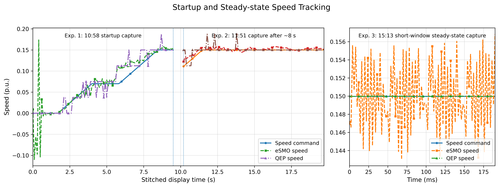
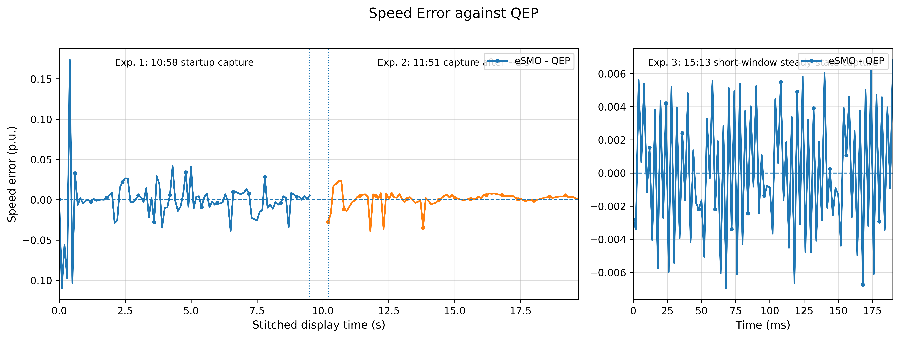
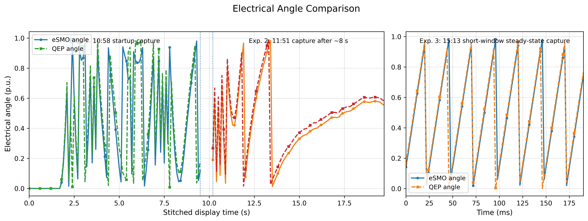
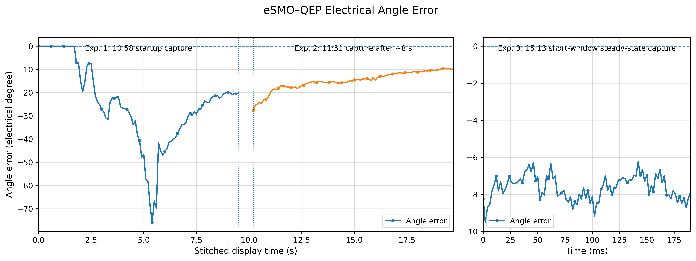
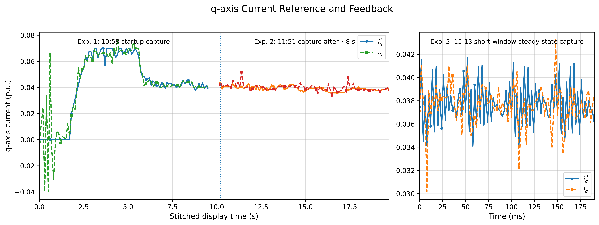
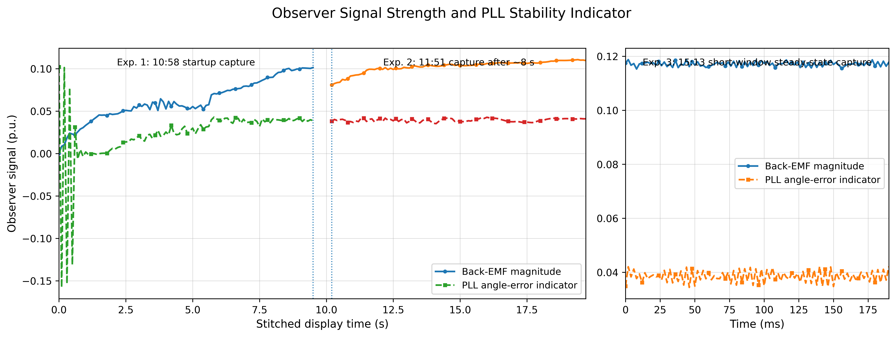

#### 三组稳态短窗口实验

该组实验在稳态后分别记录 `0.10/0.15/0.20 pu` 三段 500 Hz、96 点短窗口，用于判断 eSMO/QEP 角度误差随速度的趋势。

| 目标速度 | 角度误差均值 | 角度误差峰峰值 | 去均值纹波 RMS | eSMO速度均值 | QEP速度均值 | Eq_mag均值 |
| --- | ---: | ---: | ---: | ---: | ---: | ---: |
| 0.10 pu | `-17.41°` | `4.94°` | `1.04°` | `0.1000 pu` | `0.1031 pu` | `0.086` |
| 0.15 pu | `+9.31°` | `3.77°` | `0.72°` | `0.1501 pu` | `0.1512 pu` | `0.118` |
| 0.20 pu | `+14.15°` | `3.02°` | `0.63°` | `0.2000 pu` | `0.1949 pu` | `0.149` |

结论：

1. eSMO 速度均值在三组实验中都接近目标速度，说明速度估计和速度闭环的稳态跟随已经较稳定。
2. 角度误差去均值纹波随速度升高减小：`0.10 pu` 约 `1.04° RMS`，`0.20 pu` 约 `0.63° RMS`。这符合低速反电动势较弱时 eSMO 角度精度较差的规律。
3. 角度误差均值在 `0.10 pu` 与 `0.15/0.20 pu` 之间发生符号变化，不能简单用单一固定角度偏置或单一采样延迟解释。因此当前更优先怀疑 QEP 旁路零位一致性、QEP 参考速度诊断链路和不同记录条件，而不是直接大幅修改 eSMO 滑模参数。
4. 在 QEP 参考速度改为 `SPEED_MEAS_QEP` 滤波链路之前，`qepSpeed_q15` 的短窗口波动包含明显计数量化成分，不应作为高精度速度真值。v6.0 已在代码中修正该诊断链路，下一轮实验应基于新的 QEP 参考速度再次记录 `0.10/0.15/0.20 pu` 数据。
5. 当前阶段不建议立即调大或调小 `Kslide`、PLL 增益等 eSMO 本体参数。下一步应先用 v6.0 的滤波 QEP 速度诊断链路复测，确认角度误差均值的重复性和速度相关性，再决定是调整 `M*_ESMO_ANGLE_OFFSET_PU`、角度延迟补偿，还是继续优化滑模/PLL 参数。

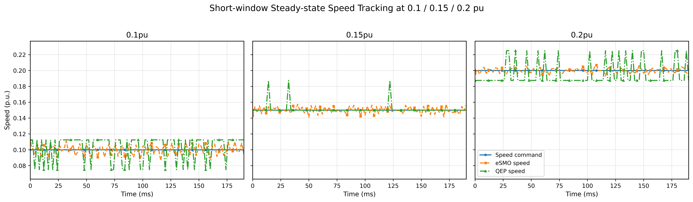
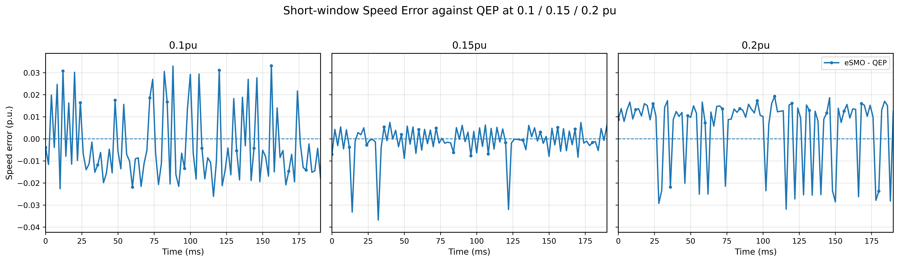
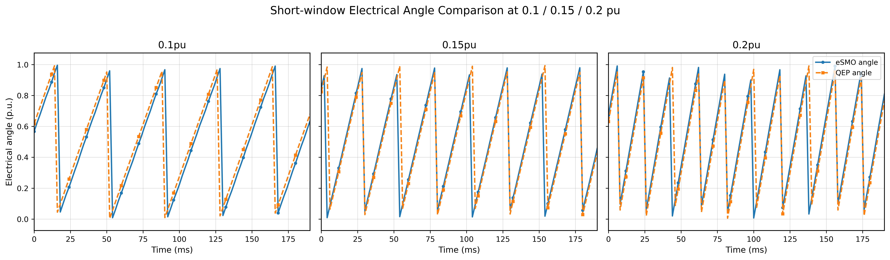
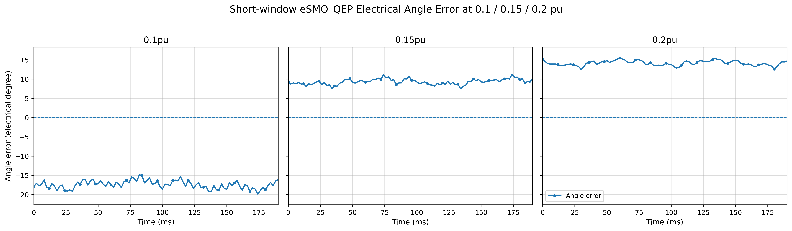
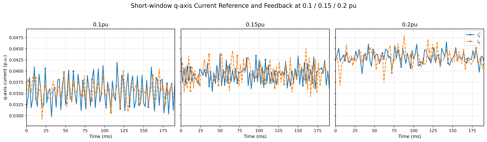
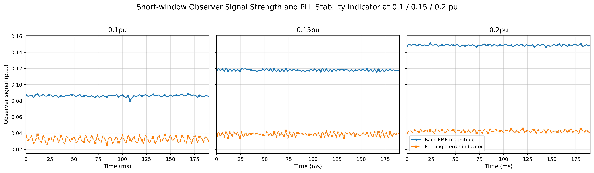

### v7.0（2026-06-07）

1. 本阶段从“eSMO/QEP 稳态角度误差不符合物理直觉”开始。早期短窗口数据中，`rawAngleErr` 与 `afterDelayErr` 约为 `+100°~+120°`，而 `final angleErr` 约为 `-20°~-40°`；同时 `afterDelayErr - final angleErr` 几乎恒定，约 `144°`。这个特征不像 Kslide、PLL 或 delaySF 造成的随机观测误差，更像两个角度坐标系之间存在固定零位变换。
2. 进一步分析角度链路后确认，eSMO final angle 是 `thetaPLL + speed delay compensation - esmoAngleOffsetPu` 后实际给 FCL Park 使用的控制角；而当时 QEP 旁路角度被改成了“物理 index 为零”的角度。物理 index 零位并不天然等于电机 d 轴磁链零位、FOC 电角度零位或 eSMO final angle 零位，所以直接用该角度做 `eSMO - QEP` 会把零位差误判为滑模观测误差。
3. 回看原始 QEP/FCL 工程后，确认原始流程不是把物理 index 当作 FOC 零点，而是 alignment 先建立 FOC 电角度零位，index 只用于后续重新装载并保持该零位。因此 v7.0 将 QEP 旁路参考恢复到这一约定：首次捕获 index 后保存 `indexCount` 到 `QPOSINIT`，不再重写 `QPOSCNT` 让物理 index 变成 0。
4. 修改后继续使用 `POSITION_FEEDBACK_ESMO` 闭环控制，QEP 只作为旁路参考。0.2 pu 稳态短窗口 96 点数据中，`angleErr_q15` 均值由此前几十度级别下降到约 `-0.94°`，去均值 RMS 约 `0.61°`，峰峰值约 `2.69°`；`esmoSpeed_q15` 均值约 `0.20003 pu`，`qepSpeed_q15` 均值约 `0.20007 pu`。
5. 0.5 pu 稳态短窗口测试由于后段数组没有完整复制，仅有 71 点，但仍显示同一趋势：`angleErr_q15` 均值约 `-1.46°`，去均值 RMS 约 `0.81°`，峰峰值约 `2.79°`；`esmoSpeed_q15` 均值约 `0.49926 pu`，`qepSpeed_q15` 均值约 `0.50001 pu`。
6. 上述结果说明，原先 `-20°~-40°` 的 final angle error 主要来自 QEP 参考角零位定义不一致，而不是 eSMO 观测器本体存在同等幅度的真实角度误差。v7.0 后，`esmoAngle_q15 - qepAngle_q15` 才开始接近“eSMO final angle 相对 QEP FOC 零位参考角”的真实误差，可用于后续滑模观测性能评估。
7. 后续建议在不改变 eSMO 控制逻辑的前提下，补测 `0.10/0.30/0.50 pu` 稳态短窗口，尤其 0.5 pu 需要完整 96 点。若各速度下 final angle error 均值维持在约 `±2°` 内、去均值 RMS 约 `1°` 内，则可以把“QEP 参考零位统一”阶段收束，进入真正的 eSMO 参数与性能指标优化阶段。

### v8.0（2026-06-13）

#### 阶段问题与目标

v7.0 之后的主要问题是：QEP 参考零位已经统一，`eSMO final angle - QEP angle` 可以用于评价无感角度，但在 0.4 pu、0.5 pu 等较高速度下，多次不重新烧录、仅 `MOTOR_STOP` 后再次 `MOTOR_RUN`，同一速度的 `angleErr` 均值仍可能落在不同固定偏置上。这个现象说明问题不再是单纯的物理 index 零位错误，而更像是 eSMO 接管、停止后再启动、观测器内部状态与角度交接状态没有完全回到一致初始条件。

本版本合入了用户最终调通后的代码版本。实验表明，0.2 / 0.3 / 0.4 / 0.5 pu 下各做两次短窗口稳态记录后，同速两次 `angleErr` 均值已经高度接近，原先“同速实验角度均值随机跳变”的问题得到明显修复。0.5 pu 下仍可看到速度、q轴电流、反电势幅值和 PLL 指标存在周期纹波，这更像是高转速电压裕量和电流环状态问题，而不是角度零位随机漂移问题。

#### 关键性能参数

数据来自 `0613_1635` 序号的 8 组 RAM 二进制短窗口实验：

| 速度指令 | eSMO均速 / pu | QEP均速 / pu | 速度误差RMS / pu | 速度误差峰值 / pu | 角度误差均值 / 电角度 | 去均值RMS / 电角度 | IqRef峰值 / pu | IqFbk峰值 / pu | Eq_mag均值 / pu | thetaErr RMS / pu | 电压利用率均值 | 电压利用率最大值 |
| --- | ---: | ---: | ---: | ---: | ---: | ---: | ---: | ---: | ---: | ---: | ---: | ---: |
| 0.2 pu | 0.1998 | 0.1998 | 0.00363 | 0.00841 | -2.79° | 0.69° | 0.0531 | 0.0551 | 0.153 | 0.0425 | 0.390 | 0.490 |
| 0.3 pu | 0.3001 | 0.3000 | 0.00300 | 0.00676 | -2.45° | 0.60° | 0.0618 | 0.0657 | 0.218 | 0.0571 | 0.557 | 0.643 |
| 0.4 pu | 0.3999 | 0.4000 | 0.00246 | 0.00534 | -1.54° | 0.47° | 0.0688 | 0.0715 | 0.277 | 0.0762 | 0.722 | 0.759 |
| 0.5 pu | 0.5001 | 0.4996 | 0.01229 | 0.01895 | +1.52° | 0.51° | 0.0814 | 0.0788 | 0.303 | 0.0966 | 0.885 | 0.934 |

#### 同速重复性

| 速度 | Exp1 angleErr均值 | Exp2 angleErr均值 | 两次差值 |
| --- | ---: | ---: | ---: |
| 0.2 pu | -2.87° | -2.71° | 0.16° |
| 0.3 pu | -2.49° | -2.42° | 0.06° |
| 0.4 pu | -1.51° | -1.57° | 0.06° |
| 0.5 pu | +1.57° | +1.48° | 0.09° |

#### 阶段结论

- eSMO 与 QEP 的速度均值在 0.2 到 0.5 pu 范围内基本一致。
- eSMO-QEP 电角度误差均值收敛到约 -3° 到 +2° 范围内，重复启动后的随机固定相位偏置显著减小。
- 去均值角度纹波 RMS 约 0.47° 到 0.69°，说明短窗口内角度抖动较小。
- 0.5 pu 下速度误差 RMS、Iq 纹波、Eq_mag 纹波、thetaErr 纹波和电压利用率明显升高，提示下一阶段应重点分析高转速电压裕量、电流环裕量和观测器稳定性，而不是再把零位随机性作为主要矛盾。

#### 性能图表

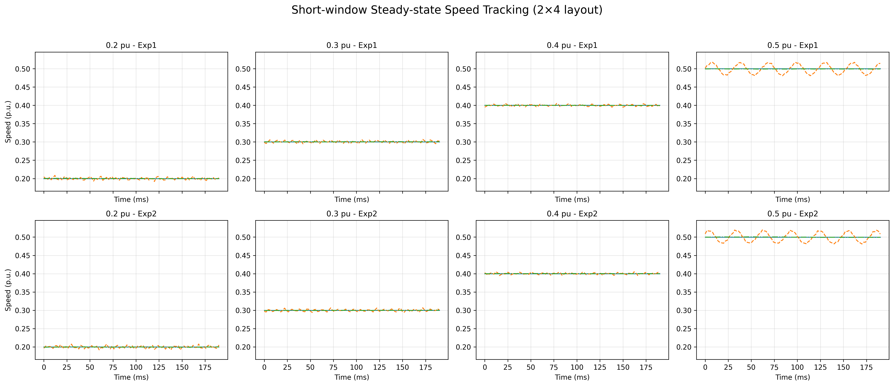

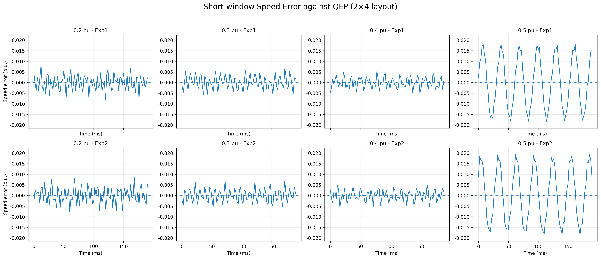

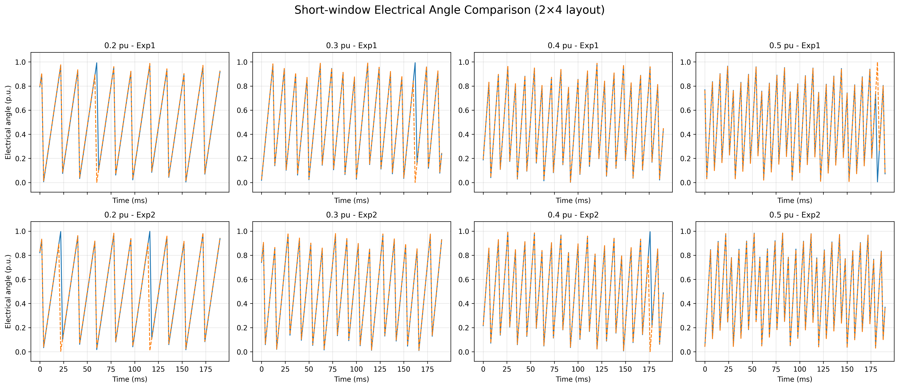

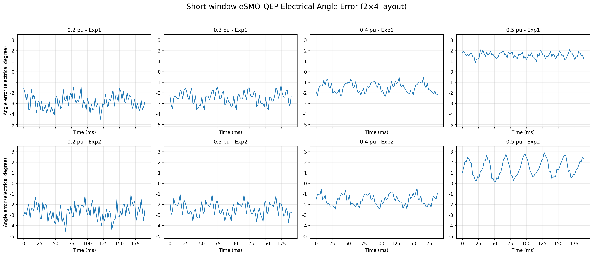

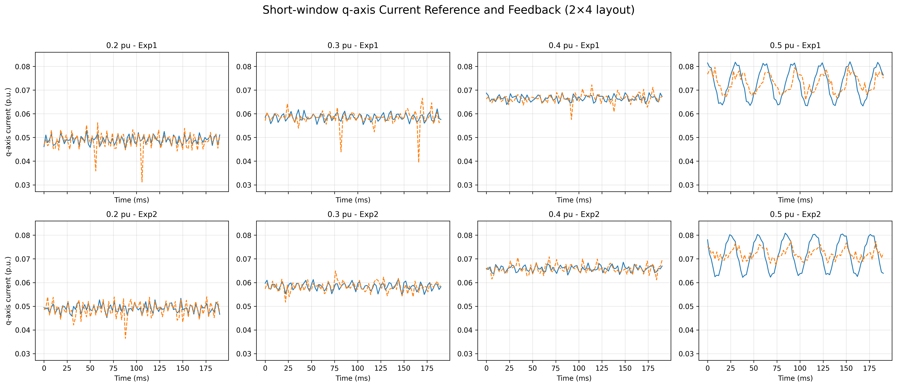

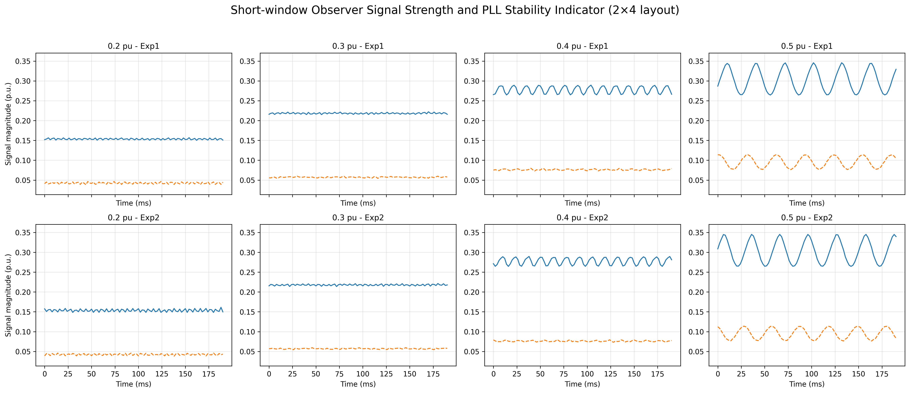

相关 CSV 数据也随图表一起放在 `figures/v8.0/0613_1635_dualrun_2x4/` 目录中，便于后续复查和重新绘图。

### v9.0（2026-06-23）

#### 阶段问题与目标

v8.0 之后，硬件调试进入高速性能和全电角度精度优化阶段。初期版本在提速至约 0.8 pu 时会出现减速、停转或电压限幅；部分动态限幅和接管修改又引入了电机 0 短暂停转、反转、双电机不同步及高速噪声增大等回归。因此，v9.0 改为以 2026-06-22 稳定工程为基线，只选择性恢复已验证的高速功能。

本阶段的验收目标为：

1. 双电机仍能保持原稳定启动和 eSMO 平滑接管，不引入额外停转、反转或明显噪声回归。
2. 电机 0 在 0.2–0.9 pu 范围内能够稳态运行，不触发 `tripFlagDMC`。
3. 以 QEP FOC 零位参考角为基准，各测试速度下的 eSMO 最终控制角最大绝对误差不超过 10 电角度。

#### 调试迭代过程

1. 先恢复 2026-06-22 版本中已证明稳定的启动 Iq、角度混合和速度 PI 接管路径，撤回会改变接管转矩的实验性逻辑。
2. 保留 0.7–0.9 pu 范围内经硬件验证的 PLL Kp 分段增益，并将 d/q 轴 PI 电压限幅固定为停机时设置、运行时保持，避免动态缩放与启动、同步逻辑互相耦合。
3. 修正电压诊断口径，将物理调制率与 d/q PI 限幅使用率分开记录，排除“物理调制未超限但 PI 诊断报超限”的误判。
4. 使用 `esmoCompareLog[]` 分别记录 0.2–0.9 pu 稳态短窗口，分析表明角度周期纹波较小，主要误差来自不同速度下的稳态直流偏置。
5. 根据完整电角度日志校正速度分段偏置表，并关闭在 0.9 pu 下与偏置补偿叠加后出现过补偿的 `thetaErr` 前馈。
6. 为保留 96 点日志且不影响 LS RAM，将 `ESMO_COMPARE_LOG_DATA` 放入 `RAMGS6`，并将零初值诊断数组放入 `.bss`，解决 `.data`/`.bss` 超过单块 `0x800` 的链接问题。

#### 实验条件与记录设置

- 对象：电机 0，正转稳态 `POSITION_FEEDBACK_ESMO` 闭环，QEP 仅作为 FOC 零位下的旁路参考。
- 转速：0.2、0.3、0.4、0.5、0.6、0.7、0.8、0.9 pu。
- 采样：每组 500 Hz、96 点，窗口长度 0.192 s；八份 BIN 均为 3264 byte，全程 `lsw=ENC_CALIBRATION_DONE`。
- 验收指标：`max(abs(eSMO angle - QEP angle)) <= 10 electrical degrees`。

#### 全电角度验证结果

| 速度 | 误差范围 / 电角度 | 误差均值 / 电角度 | 去均值 RMS / 电角度 | 最大绝对误差 / 电角度 |
| ---: | ---: | ---: | ---: | ---: |
| 0.2 pu | -1.08° – +2.18° | +0.56° | 0.69° | 2.18° |
| 0.3 pu | -3.76° – -1.79° | -2.69° | 0.53° | 3.76° |
| 0.4 pu | -0.75° – +0.90° | +0.13° | 0.44° | 0.90° |
| 0.5 pu | +0.69° – +2.47° | +1.62° | 0.51° | 2.47° |
| 0.6 pu | -0.76° – +1.31° | +0.09° | 0.48° | 1.31° |
| 0.7 pu | +0.89° – +2.70° | +1.71° | 0.43° | 2.70° |
| 0.8 pu | -0.32° – +1.36° | +0.49° | 0.49° | 1.36° |
| 0.9 pu | -5.10° – -3.50° | -4.39° | 0.46° | **5.10°** |

八个速度的最坏结果为 0.9 pu 下 5.10°，相对 10° 限值仍有约 4.90° 余量；全速域去均值角度纹波 RMS 为 0.43°–0.69°。Iq 跟踪误差 RMS 不超过 `2.3e-3 pu`，Id RMS 不超过 `2.7e-3 pu`。

#### 性能图表

下列图片为用户提供的 SCI 风格原图，在仓库中按原文件保存，未重新绘制。完整分析页见 [`eSMO_report.html`](figures/v9.0/2026-06-23_full_angle_validation/eSMO_report.html)。

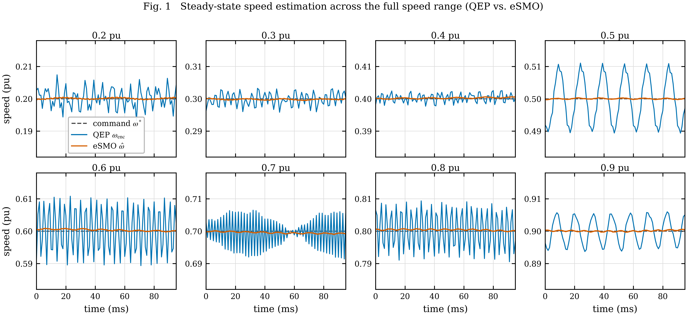

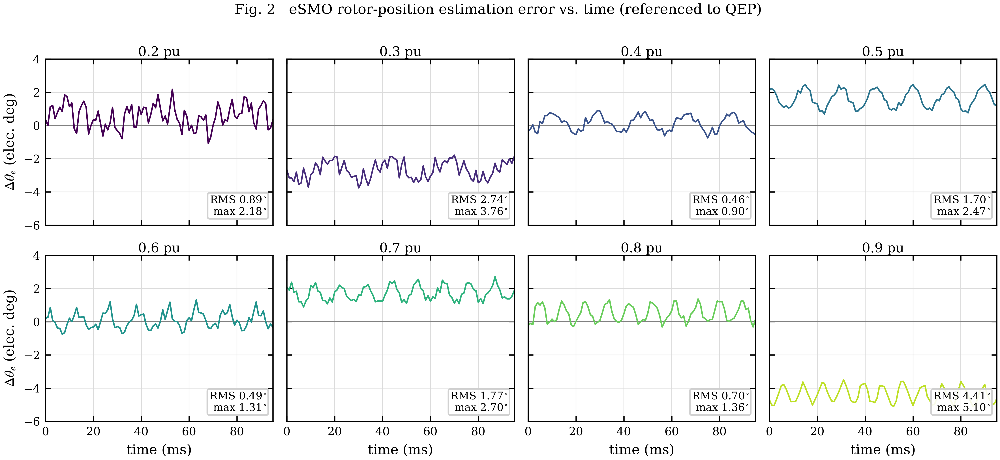

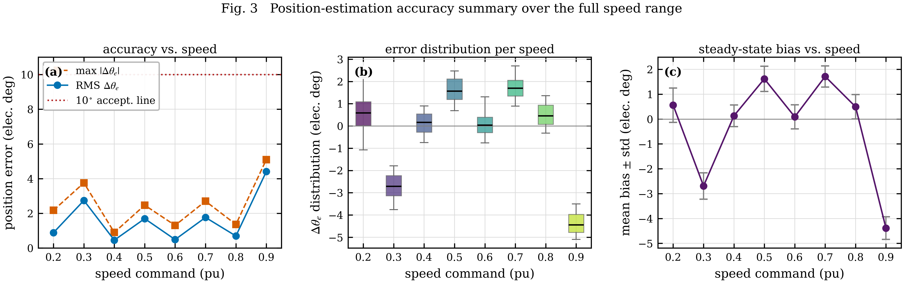

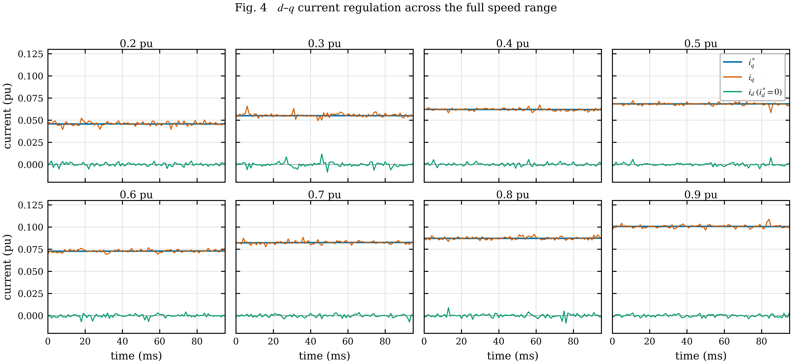

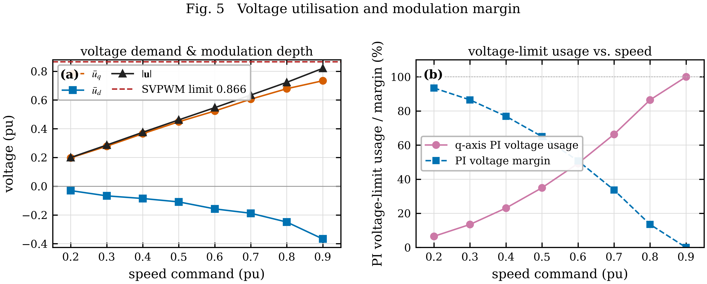

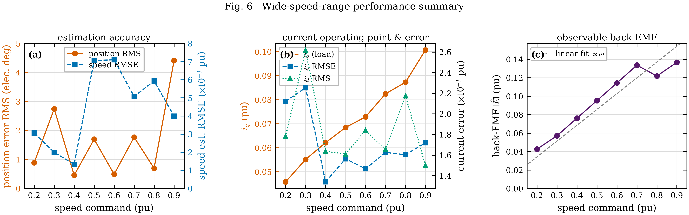

> **固件字段核对说明：** HTML 中部分通道名称由波形反推，与 v9.0 固件 `ESMO_CompareLog_t` 的确定定义存在差异。固件中 ch6 为 `esmoSpeed_q15`、ch7 为 `qepSpeed_q15`，因此图 1 的 QEP/eSMO 图例需反向理解；ch13 为 d/q PI 限幅归一化使用量的平方和 `piUseSq`，不是单独 q 轴物理调制率；ch15 为 `Eq_mag`，ch16 为 `thetaErr`，因此图 6(c) 不作为反电动势线性结论的依据。图 2/3 的角度误差结论与图 4 的电流跟踪结论不受此标注差异影响。

#### 阶段结论与边界

v9.0 在当前台架、正转和本次温度/负载条件下，已完成“0.2–0.9 pu 全电角度范围估计误差不超过 10°”的阶段目标。该结论尚不代表已完成全工况鲁棒性验证；反转、负载阶跃、多次重复启停、冷热机和长时温升属于下一阶段。

原始 BIN、上传的 6 张 PNG、HTML 分析、图注说明和汇总 CSV 均位于 [`figures/v9.0/2026-06-23_full_angle_validation/`](figures/v9.0/2026-06-23_full_angle_validation/)。

### v10.0（2026-07-16）

#### 阶段目标与实验准备

v9.0 完成全速域稳态角度精度验证后，硬件实验进入“参数变化鲁棒性研究”阶段。该阶段不修改真实电机、FCL 电流环或机械负载，而是通过改变 eSMO 内部假定的定子电阻和电感，构造可重复的观测器参数失配，考察不同转速与失配组合下的角度估计误差、速度误差和锁定边界。

1. 以 `esmoRsScale[x]`、`esmoLsScale[x]` 表示观测器假定值与工程名义值之比；两者均为 `1.0` 时作为名义参数基线。
2. 参数只在 `MOTOR_STOP` 状态修改，复位路径重新调用 `ESMO_setParams()`，下一次 `MOTOR_RUN` 生效；通过 `esmoRsAssumedOhm[x]` 和 `esmoLsAssumedH[x]` 确认实际应用值。
3. `esmoLostLock[x]` 为单次运行锁存判据：无感闭环完成接管后，若电角度误差超过 30°或速度误差超过 0.05 pu，并连续持续 100 ms，则置 1；该标志只记录实验结果，不代替硬件原有保护。
4. 96 点 `esmoCompareLog[]` 继续记录稳态角度、速度、电流、电压和观测器状态，用于计算每个参数网格点的量化指标；失锁标志作为每次运行的附加布尔结果读取，不占用新的日志通道。

#### 名义参数基线结果

在 `RsScale=1.0`、`LsScale=1.0` 条件下，已完成 0.2、0.5 和 0.9 pu 三个代表转速的基线记录，三次测试的 `esmoLostLock[0]` 均为 0。该结果说明加入运行时参数缩放、日志触发修正和失锁监视后，名义参数下未破坏 v9.0 的低速、中速和高速闭环锁定状态，可以继续开展单参数扫描及 Rs/Ls 二维网格实验。

当前阶段结论仅证明 v10.0 实验框架在名义参数点可用，尚不能据此宣称已经获得完整鲁棒安全域。后续需在统一转速和测试流程下完成失配网格、临界点重复试验及锁定边界统计，再绘制不同转速的角度误差热力图和最坏包络图。

### v11.0（2026-07-20）

#### QEP 日志修复与机械增益辨识

为给后续差模扰动观测器提供台架等效机械模型，v11.0 首先修复了纯 QEP 模式下日志无法自动触发、QEP 通道未直接取自主反馈链路的问题。修复后，0.5 pu 和 0.6 pu 稳态数据均完整记录 96 点，三次 0.5 pu 至 0.6 pu 慢斜坡实验的指令与速度轨迹具有良好重复性。

由于慢斜坡产生的附加加速电流与摩擦、温漂和稳态电流漂移处于相近数量级，进一步将日志提高到 100 Hz，并使用更快的速度斜坡完成三次动态辨识。三次实验中，0.5 pu 至 0.6 pu 指令变化约需 0.65 s，平均机械加速度分别为 0.14375、0.14440 和 0.14381 pu/s，`iqRef` 峰值分别为 0.06775、0.06696 和 0.06671 pu。

按归一化模型 `dω/dt = b0·iq + cω·ω + c0` 进行最小二乘辨识，三次等效机械增益分别为 19.205、19.242 和 19.188 `(pu/s)/pu`，决定系数为 0.949-0.957。由此选取后续控制器的名义增益 `b0=19.0`，并保留 17.0-21.0 的实验调整范围。按工程电流基值与电机转矩系数作辅助换算，整个对拖台架的等效转动惯量约为 `5.9×10^-5 kg·m²`；实际控制代码优先使用直接辨识的归一化增益，以避免峰值/RMS 电流口径造成额外换算误差。

#### 阶段结论

QEP 稳态、慢斜坡和快速斜坡数据已经满足首版差模扰动观测器参数化要求。下一阶段将在保留两台电机独立速度 PI 的基础上，删除旧协同 PI，实现可独立使能的共模—差模协调模型、差模扰动观测器及等量反向 q 轴电流补偿，并通过 0.6 pu 单侧非对称加载实验逐步验证补偿极性、限幅、观测带宽和抗扰性能。

### v12.0（2026-08-10）

#### 差模扰动观测协同控制验证

在 v11.0 识别得到的等效机械增益基础上，首版协同参数采用 `syncPlantGain=19.0`、观测器带宽 5 Hz、差模比例增益 0.10、补偿限幅 0.015 pu、补偿斜率 0.10 pu/s、速度死区 0.001 pu 和最低使能速度 0.20 pu。先在 0.6 pu、QEP、无外加负载条件下完成 `flagSyncPI=false/true` 对照，确认补偿极性正确、两台电机无跳变且未触发保护，再转入双 eSMO 闭环实验。

最终在 0.6 pu 下采用单侧三相整流桥与 20 Ω 功率电阻构成非对称加载装置，分别完成突加负载和突卸负载实验；协同关闭与开启各重复 3 次，共获得 12 组 RAM 日志及同步的转矩传感器上位机记录。测试期间两台电机均保持 eSMO 锁定，未触发 `tripFlagDMC`。

| 指标 | 突加负载改善 | 突卸负载改善 |
| --- | ---: | ---: |
| 双机速度差峰值降低 | 90.3% | 90.8% |
| 差模速度 RMS 降低 | 93.0% | 93.1% |

典型加载电机恢复时间由约 2.67 s 缩短至约 1.78 s；协同开启时突加与突卸过程的最大电角度误差分别约为 4.32° 和 3.98°，仍处于既定 10° 误差目标以内。实验结果表明，新算法主要抑制由单侧负载引起的差模速度偏差，同时没有替代或扰乱负责公共速度跟踪的两套独立速度 PI，实现了无位置传感双电机系统中速度跟踪与协同性能的职责分离。

#### 阶段结论

v12.0 已完成“机械增益辨识—保守参数初始化—QEP 空载极性验证—eSMO 非对称加载重复实验”的闭环验证流程。当前结论适用于本台架、正转、0.6 pu 和 20 Ω 阻性加载条件；进一步推广到更宽速度范围、反转、不同负载强度和参数失配工况，仍需按相同 ON/OFF 重复实验流程扩展验证。

