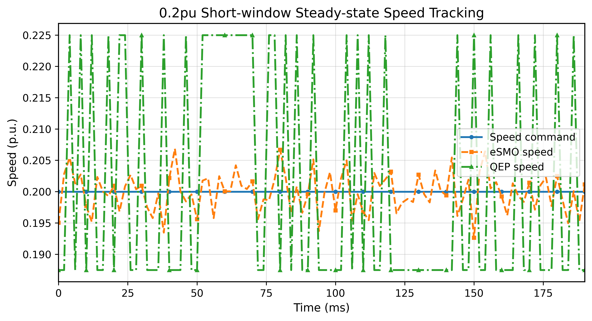
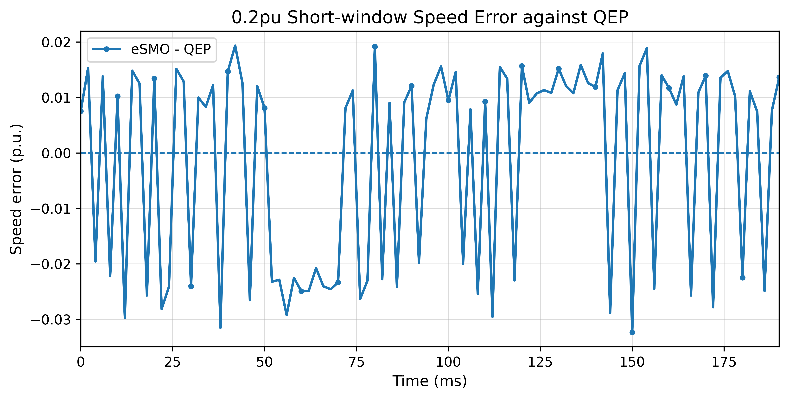
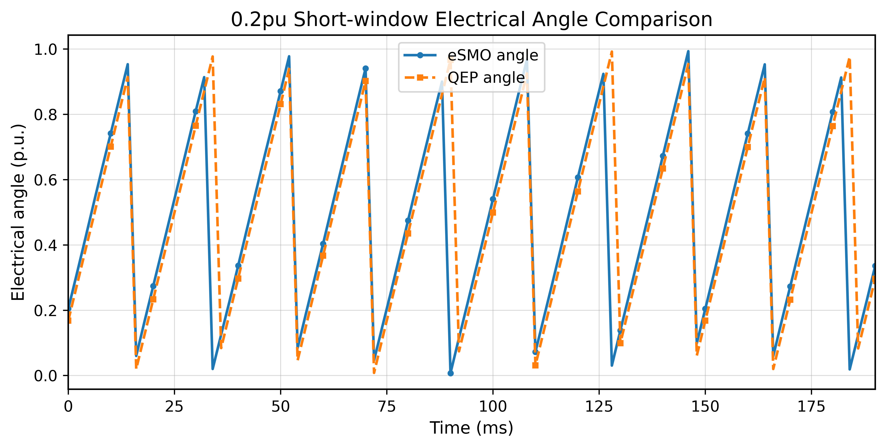
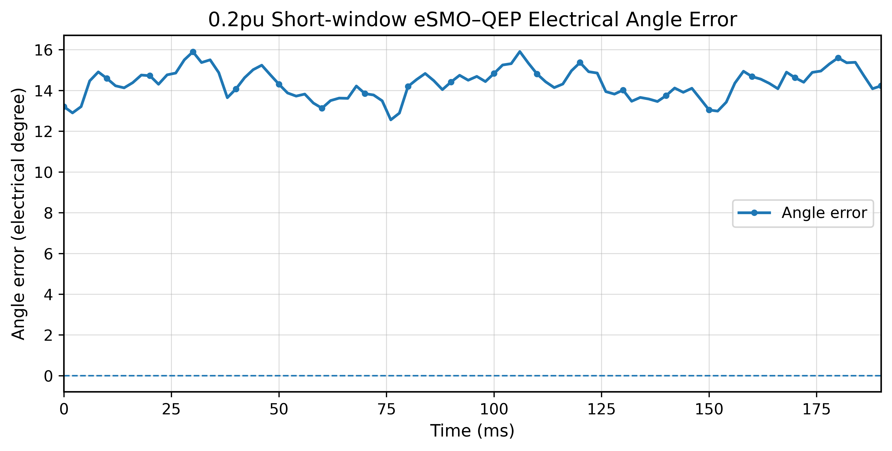
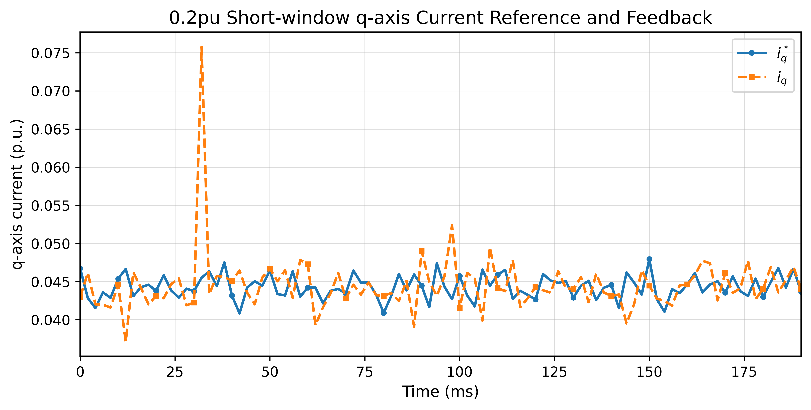
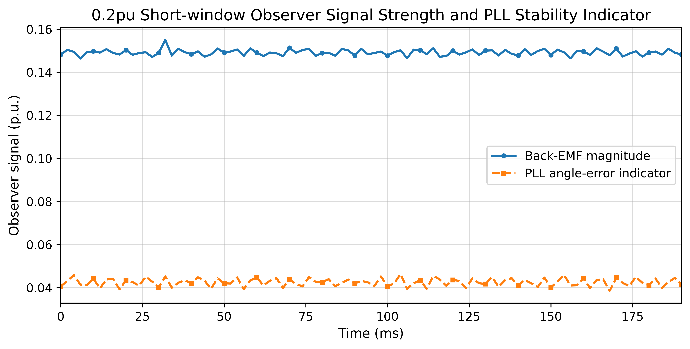

# Dual-Motor-SMO-Control
本仓库用于备份 `dual_axis_servo_drive_fcl_qep_f2837x` 双电机工程中，相对最初原始工程新增或修改过的代码文件。`v4.0/`、`v5.0/`、`v6.0/` 等版本目录只放代码文件，不放 CCS 工程元数据 `.project`、编译产物或完整 SDK 工程副本。

## eSMO 切入滑模闭环的具体过程

以 M1 为例，只有同时满足下面两个条件，才表示真正进入 eSMO 无感闭环：

```c
motorVars[0].positionFeedback == POSITION_FEEDBACK_ESMO
motorVars[0].ptrFCL->lsw == ENC_CALIBRATION_DONE
```

若 `M1_POSITION_FEEDBACK=POSITION_FEEDBACK_QEP`，`lsw=ENC_CALIBRATION_DONE` 表示 QEP 闭环；若为 `POSITION_FEEDBACK_ESMO_MONITOR`，控制仍由 QEP 完成，eSMO 只是旁路观测。

当前 M1 切入流程：

1. `ENC_ALIGNMENT`：对齐阶段，`IdRef_start=M1_STARTUP_ID_REF`，Iq 为 0。该阶段只建立一个确定的初始电角度，不使用 eSMO 闭环控制。
2. `ENC_WAIT_FOR_INDEX`：eSMO 开环牵引阶段。eSMO 模式下禁止 CLA 因 QEP index 自动切闭环，CPU 侧继续用开环斜坡角 `rg.Out` 作为 FCL Park 角度，同时 eSMO 在旁路运行并积累反电动势、PLL 角度和速度估计。开环目标由 `M1_ESMO_FORCE_SPEED` 给定，最少强拖时间由 `M1_ESMO_FORCE_RUN_SEC` 给定。
3. 启动 Iq 控制：`getSensorlessStartupIqRef()` 只在 `ENC_WAIT_FOR_INDEX` 阶段直接给 FCL 的 `pi_iq.ref`。当前逻辑先按 `M1_STARTUP_IQ_MIN_SCALE` 从较低 Iq 软启动，随后随 `esmoForceRunCntr` 逐步爬升到 `M1_STARTUP_IQ_REF`；若 `esmoSpeedPu` 已经超过当前 `rc.SetpointValue`，再按 `M1_STARTUP_OVERSPEED_BAND` 做超速削弱，避免开环牵引阶段过冲。
4. 接管判断：强拖时间满足后，要求 `rc.SetpointValue>=M1_ESMO_TAKEOVER_MIN_SETPOINT`、`abs(esmoSpeedPu)>=M1_ESMO_TAKEOVER_MIN_SPEED`、`Eq_mag>=M1_ESMO_TAKEOVER_MIN_BEMF`，且 `rc.SetpointValue` 与 `esmoSpeedPu` 方向一致。满足后调用 `syncSensorlessEstimatorAngle()`，把 eSMO 内部角度同步到当前开环斜坡角附近，并置 `lsw=ENC_CALIBRATION_DONE`。
5. 接管瞬间：`lsw` 置为 `ENC_CALIBRATION_DONE` 之后，FCL Park 角度来源切换为 `esmoAnglePu`，速度反馈切换为 `esmoSpeedPu`。同时调用 `seedSensorlessSpeedController()`，用切换前的启动 Iq 给速度 PI 的积分项做初值种入，避免 `pi_iq.ref` 在启动 Iq 与速度 PI 输出之间突跳。
6. 接管过渡期：`isSensorlessTakeoverActive()` 并不是“是否已经进入 eSMO 闭环”的唯一判据，它表示 `lsw=ENC_CALIBRATION_DONE` 之后的一段角度混合期，长度由 `M1_ESMO_TAKEOVER_SEC` 决定。在这段时间里，`blendSensorlessAngle()` 按 `esmoTakeoverCntr/esmoTakeoverCntMax` 形成 `alpha`，把控制角度从开环斜坡角逐步混合到 eSMO 观测角：

```c
angleErrPu = wrapPuHalf(estimatorAnglePu - openLoopAnglePu);
esmoAnglePu = normalizePu(openLoopAnglePu + alpha * angleErrPu);
```

这里的“角度混合”意思是：刚切入时 `alpha` 接近 0，控制角度仍接近开环斜坡角；随后 `alpha` 逐渐增大，控制角度平滑靠近 eSMO 角度；最后 `alpha=1`，控制角度完全由 eSMO 角度决定。这样做是为了避免 Park 角度从开环角突然跳到 eSMO 角度，引发 q 轴电流、转矩和转速突变。

早期版本中，接管过渡期不仅用于角度混合，还在 `pi_iq.ref` 里继续使用 `getSensorlessStartupIqRef()`。因此即使 `lsw` 已经变成 `ENC_CALIBRATION_DONE`，约 `M1_ESMO_TAKEOVER_SEC` 秒内的 Iq 仍主要来自启动转矩逻辑，而不是正常速度 PI。0.2pu 实验中出现的多次 `piIqRef_q15=3276`，就是这一逻辑导致的 `IqRef=0.10pu` 启动转矩反复参与，而不是协同控制器或普通速度 PI 本身过强。当前版本已将这两件事拆开：接管过渡期只继续做角度混合，Iq 则在切入后交给 eSMO 专用速度 PI 调节。

7. `ENC_CALIBRATION_DONE` 稳态：eSMO 提供电角度和速度，FCL Park 角度使用 `esmoAnglePu`，速度闭环输出 `pid_spd.term.Out` 作为 Iq 主指令。eSMO 模式下速度 PI 使用较保守的 `M*_ESMO_SPEED_PID_KP/KI`，目的是降低 `esmoSpeedPu` 波动被速度环放大成 Iq 波动的程度；QEP 模式仍保留原速度 PI 参数。

v6.0 当前状态：M1/M2 均默认 `POSITION_FEEDBACK_ESMO`，启动 Iq 已由完整台架早期测试所需的 `0.10 pu` 下调到 `0.07 pu`，`M*_STARTUP_IQ_MIN_SCALE` 保持 `0.20`，以降低双电机同电源启动时的峰值电流。`esmoStartupLog[]` 为节省 RAM 暂时关闭，新增的 `esmoCompareLog[]` 只用于 eSMO 与 QEP 旁路参考的观测质量评估，不参与 FCL 角度、速度 PI、Iq 指令、接管判据或协同控制器。

## 代码文件修改说明

### v4.0（2026-05-27 提交）

- `include/dual_axis_servo_drive.h`：引入 sensorless 接口，保留原 QEP 路径。
- `include/dual_axis_servo_drive_sensorless.h`：新增双电机 eSMO 适配层接口，使用前向声明避免 `MOTOR_Vars_t` 包含顺序问题。
- `include/dual_axis_servo_drive_settings.h`：增加反馈源兼容定义，并将最终反馈选择转移到 CLA 安全的 `dual_axis_servo_drive_user.h`。
- `include/dual_axis_servo_drive_user.h`：增加 QEP/eSMO/eSMO monitor 选择宏；按电机参数 txt 修正 Rs、Ld、Lq、base current、base voltage、base flux、base frequency；加入 M1/M2 eSMO 和启动接管参数。
- `include/esmo.h`、`sources/esmo.c`：从单电机无感工程移植 eSMO 算法，适配当前工程 include path 和类型。
- `include/fcl_enum.h`：增加 `POSITION_FEEDBACK_*` 兼容宏，防止真实工程仍链接 SDK 原始头文件时报未定义。
- `libraries/fcl/include/fcl_cpu_cla_dm.h`：扩展 `MOTOR_Vars_t`，加入 eSMO handle、反馈模式、角度/速度、误差、启动和接管计数、电压电流缓存等字段，并更新默认初始化。
- `libraries/fcl/source/fcl_cla_code_dm.cla` 与 `sources/fcl_cla_code_dm.cla`：eSMO 模式下禁止 CLA 用 QEP index 提前切 `ENC_CALIBRATION_DONE`，改由 CPU eSMO 接管条件统一控制。
- `sources/dual_axis_servo_drive.c`：加入 eSMO 运行、开环牵引、接管判断、角度同步、速度反馈替换、`esmoStartupLog[]` 和动态削弱启动 Iq 逻辑。
- `sources/dual_axis_servo_drive_sensorless.c`：实现双电机 eSMO adapter，负责 eSMO 输入转换、PLL 运行、角度偏置、接管判断和角度 blend。
- `sources/dual_axis_servo_drive_user.c`：初始化电机参数、eSMO 参数、启动/接管计数和 eSMO handle。
- `sources/fcl_cpu_code_dm.c`：eSMO 模式下 Park 角度使用 `esmoAnglePu`，并保护 QEP wrap 逻辑。

### v5.0（2026-05-30 提交）

- `include/dual_axis_servo_drive_user.h`：将默认反馈源从单电机/调试阶段切换为双电机 eSMO 实控，`M1_POSITION_FEEDBACK` 与 `M2_POSITION_FEEDBACK` 均设为 `POSITION_FEEDBACK_ESMO`。
- `include/dual_axis_servo_drive_user.h`：根据完整实验平台负载条件，将 M1 启动 Iq 从空轴可用的 `M1_STARTUP_IQ_REF=0.04`、`M1_STARTUP_IQ_MIN_SCALE=0.10` 调整为 `0.10`、`0.20`。
- `include/dual_axis_servo_drive_user.h`：将 M2 启动 Iq 同步为 `M2_STARTUP_IQ_REF=0.10`、`M2_STARTUP_IQ_MIN_SCALE=0.20`，使两套同型号电机和机械台架使用一致的 eSMO 启动扭矩策略。
- 其余代码文件随 v5.0 一并备份，内容保持当前工程状态，便于在真实 CCS 项目中按版本整体复刻。

### v6.0（2026-06-03 提交）

- `include/dual_axis_servo_drive_user.h`：在完整双电机实验平台上继续降低启动扭矩，将 M1/M2 `M*_STARTUP_IQ_REF` 从 v5.0 的 `0.10` 下调到 `0.07`，`M*_STARTUP_IQ_MIN_SCALE` 保持 `0.20`；当前 0.20pu 测试中双电机同电源峰值电流约 `0.322 A`，且仍能进入 `ENC_CALIBRATION_DONE`。
- `sources/dual_axis_servo_drive.c`：修正协同 PI 的使用方向，将协同补偿从容易形成正反馈的加/减方向改为：M1 的 Iq 指令使用 `pid_spd.term.Out - syncPI_out`，M2 使用 `pid_spd.term.Out + syncPI_out`；协同控制器仅在 `flagSyncPI=true`、两电机均 `MOTOR_RUN`、无故障且均进入 `ENC_CALIBRATION_DONE` 后生效。
- `sources/dual_axis_servo_drive.c`：将协同 PI 参数收敛到保守诊断值 `Kp=0.05`、`Ki=0`、输出限幅 `±0.05`，并新增 `syncSpdErr`、`syncPIActive` 等观测变量，便于先完成 eSMO 稳定性验证后再调协同。
- `sources/dual_axis_servo_drive.c`：为节省 RAM，将 `ESMO_STARTUP_LOG_ENABLE` 设为 `0U`，保留 1 点占位符，避免符号缺失；新增 `esmoCompareLog[]`，专门记录 eSMO 与 QEP 旁路参考的角度、速度、电流、反电动势和 PLL 指标。
- `sources/dual_axis_servo_drive.c`：新增 `esmoCompareLogMotor`、`esmoCompareLogArmed`、`esmoCompareLogActive`、`esmoCompareLogDone`、`esmoCompareLogIndex` 和 `esmoCompareLogDecimation`，支持自动记录启动长窗口，也支持稳态后手动置位 `esmoCompareLogArmed=1` 记录短窗口。
- `sources/dual_axis_servo_drive.c`：将 QEP 参考速度从早期“单 ISR 角度差分”改为独立 `SPEED_MEAS_QEP esmoQepSpeedForCompare[2]` 链路，复用原始 QEP 工程 `runSpeedFR()` 的滤波测速逻辑；eSMO 闭环中的 `motorVars[].speed.Speed` 仍保持为 eSMO 速度反馈，不被 QEP 诊断链路覆盖。
- `sources/dual_axis_servo_drive.c`：增加 eSMO/QEP 对比日志的字段记录，包括 `rcSetpoint_q15`、`esmoAngle_q15`、`qepAngle_q15`、`angleErr_q15`、`esmoSpeed_q15`、`qepSpeed_q15`、`speedErr_q15`、`iqRef_q15`、`iqFbk_q15`、`eqMag_q15`、`thetaErr_q15`。
- `sources/dual_axis_servo_drive.c`：接管后的 Iq 逻辑保持由速度 PI 接管，并通过 `limitSensorlessTakeoverIqRef()` 做接管期限幅，避免早期版本中 `lsw=ENC_CALIBRATION_DONE` 后仍长时间使用启动转矩导致速度猛冲。
- 其余 v4.0/v5.0 中移植 eSMO、扩展 FCL 结构体、保护 CLA QEP index、保留 QEP/eSMO/eSMO monitor 选择等基础改动继续保留。

## 代码更新日志与硬件实验迭代过程

### v4.0（2026-05-27 提交）

|     速度 |                          空轴 QEP |                       单接传感器 QEP |                            完整台架 QEP（之前） |                          完整台架 v4.0 eSMO |                            完整台架 v4.0  QEP |
| -----: | ------------------------------: | ------------------------------: | --------------------------------------: | --------------------------------------: | --------------------------------------: |
| 0.05pu | iq = 0.007 ~ 0.016<br>母线 0.017A | iq = 0.010 ~ 0.020<br>母线 0.020A | **iq = 0.093 ~ 0.098**<br>**母线 0.102A** |                                       — |                                       — |
| 0.10pu | iq = 0.012 ~ 0.015<br>母线 0.027A | iq = 0.013 ~ 0.026<br>母线 0.035A | **iq = 0.173 ~ 0.178**<br>**母线 0.332A** | iq = 0.097 ~ 0.110<br>母线 0.165A | iq = 0.104 ~ 0.110<br>母线 0.170A |
| 0.15pu | iq = 0.010 ~ 0.012<br>母线 0.037A | iq = 0.022 ~ 0.025<br>母线 0.051A | **iq = 0.252 ~ 0.257**<br>**母线 0.697A** | iq = 0.136 ~ 0.151<br>母线 0.313A | iq = 0.130 ~ 0.146<br>母线 0.318A |
| 0.18pu | iq = 0.012 ~ 0.017<br>母线 0.044A | iq = 0.016 ~ 0.027<br>母线 0.060A | **iq = 0.295 ~ 0.311**<br>**母线 1.018A** | iq = 0.168 ~ 0.180<br>母线 0.434A | iq = 0.170 ~ 0.181<br>母线 0.482A |
| 0.20pu |                               — |                               — |                                       — | **iq = 0.191 ~ 0.199**<br>**母线 0.524A** |


1. 从单电机无感工程移植 `esmo.c/h`，新增双电机 eSMO adapter，保留 QEP 控制。
2. 修复编译兼容问题：eSMO include path、`POSITION_FEEDBACK_*` 未定义、`MOTOR_Vars_t` 包含顺序、`FCL_Vars_t.positionFeedback` 与 SDK 原始结构体不兼容、CLA 不支持 `<stdlib.h>`。
3. 根据电机参数 txt 修正相电阻、电感和基准量，避免 eSMO/FCL 基准量不匹配导致观测偏差、发热和停转。
4. 先在 QEP 控制下进行 eSMO monitor 测试，验证 `0.05/0.10/0.15/0.20 pu` 稳态速度估计基本可跟随 QEP。
5. 根据 monitor 数据加入 `M1/M2_ESMO_ANGLE_OFFSET_PU=0.40`，补偿 eSMO 角度与 QEP 电角度约 `0.38~0.41 pu` 的固定偏差。
6. 初次 eSMO 接管出现反转、突加速、过流或停转。加入 `esmoStartupLog[]` 后发现 CLA QEP index 会过早切闭环。
7. 增加 CLA QEP index 保护，让 eSMO 模式只能由 CPU 侧 `isSensorlessReadyForClosedLoop()` 切入闭环，解决早切换导致的反转和方向突变。
8. 启动 Iq 从 `0.10 pu` 逐步降到 `0.04 pu`，降低启动扭矩和发热；加入超速削弱逻辑，减少突加速。
9. 将 `M1_STARTUP_IQ_MIN_SCALE` 调到 `0.10`，`M1_STARTUP_OVERSPEED_BAND` 调到 `0.03`，让超速时更早、更强地降低 Iq。
10. 将 `M1_ESMO_FORCE_SPEED` 降到 `0.08` 后一度无法切入闭环，原因是 `rc.SetpointValue≈0.07997` 略低于 `M1_ESMO_TAKEOVER_MIN_SETPOINT=0.08`。把门槛降到 `0.07` 后恢复正常接管。
11. 当前 v4.0：M1 eSMO 单电机可切入 `ENC_CALIBRATION_DONE` 并稳定运行；M2 已具备接口和参数框架，但仍需按 M1 流程单独硬件验证。

### v5.0（2026-05-30 提交）

1. 在被控电机空轴条件下，`M1_STARTUP_IQ_REF=0.04`、`M1_STARTUP_IQ_MIN_SCALE=0.10` 可以正常启动并切入 eSMO 闭环。
2. 将被控电机接入完整实验平台后，机械系统变为“被控电机 + 转矩传感器 + 另一台同型号电机机械连接”，启动负载和静摩擦明显高于空轴条件。
3. 在完整台架负载下，空轴启动 Iq 参数不足以可靠启动和切入滑模闭环；经硬件测试，`STARTUP_IQ_REF=0.10`、`STARTUP_IQ_MIN_SCALE=0.20` 可以正常启动和进入 `ENC_CALIBRATION_DONE`。
4. 基于两套平台和所有电机均为同型号的前提，将 M1/M2 启动 Iq 参数统一为 `0.10/0.20`。
5. 单电机 eSMO 移植功能已初步通过后，将默认反馈源切换为双电机 `POSITION_FEEDBACK_ESMO`，用于下一阶段双电机滑模控制测试。
6. 本次没有改变 eSMO 接管判据、角度偏置、强拖速度、强拖时间和 CLA/QEP index 保护逻辑，因此“eSMO 切入滑模闭环的具体过程”主体保持 v4.0 描述不变。


### v6.0（2026-06-03 提交）

1. 在 v5.0 双电机 eSMO 能够启动和切入闭环后，进入“观测性能验证与参数优化”阶段。该阶段目标不再只是判断能否进入 `ENC_CALIBRATION_DONE`，而是量化 eSMO 估计角度、速度相对 QEP 旁路参考的误差，并确认 eSMO 是否具备替代编码器闭环运行的基础精度。
2. 在测试协同控制器前，先修正协同 PI 的补偿方向。原协同控制器存在潜在正反馈风险：若 M1 快于 M2，补偿方向可能继续增加 M1 Iq 或削弱 M2 Iq。v6.0 改为 M1 使用 `pid_spd.term.Out - syncPI_out`，M2 使用 `pid_spd.term.Out + syncPI_out`，并要求两电机均进入 eSMO 闭环后才允许 `flagSyncPI` 生效。
3. 协同 PI 暂时保持保守参数 `Kp=0.05`、`Ki=0`、`Umax/Umin=±0.05`。硬件测试中 `flagSyncPI=true` 时可以看到 `syncPI_out` 量级很小，说明在当前阶段它主要用于后续微调，不应在 eSMO 启动和观测验证尚未完成前承担主要速度同步任务。
4. 针对双电机同电源启动电流和速度过冲问题，继续优化启动 Iq。完整平台上 `M*_STARTUP_IQ_REF=0.10` 可以可靠启动，但峰值电流偏高；逐步下调后，`M*_STARTUP_IQ_REF=0.07`、`M*_STARTUP_IQ_MIN_SCALE=0.20` 仍可在 0.20pu 下稳定进入 `ENC_CALIBRATION_DONE`，双电机同电源峰值电流约 `0.322 A`。
5. 为释放 RAM 并避免 `.bss` 溢出，暂时关闭 `esmoStartupLog[]`，新增 `esmoCompareLog[]` 作为独立诊断日志。该日志不改变控制逻辑，只记录 eSMO 与 QEP 旁路参考之间的角度、速度、电流和观测器状态。
6. 初期 `qepSpeed_q15` 由相邻 ISR 的 QEP 角度直接差分得到，在 0.20pu 短窗口中出现 `0.1875/0.2250 pu` 两档跳变。这不是实际机械速度阶跃，而是编码器计数量化被单周期差分放大的结果。因此 v6.0 将 QEP 诊断速度改为独立 `SPEED_MEAS_QEP` 对象，复用原始 QEP 工程的 `runSpeedFR()` 滤波测速链路。

#### 0.15pu 启动、后段长窗口与稳态短窗口实验

该组实验由两段 10Hz、96 点长窗口和一段 500Hz、96 点短窗口组成。前两段用于观察启动到稳态的慢过程，短窗口用于观察稳态电角度细节。

| 实验段 | 记录条件 | 主要状态 | 速度/角度结论 |
| --- | --- | --- | --- |
| Exp.1 10:58 启动长窗口 | MOTOR_RUN 后 9.6s | 覆盖 `lsw=0/1/2` 与接管过渡 | 启动阶段 eSMO 角度误差先明显增大，最深约 `-76°`，随后随 `Eq_mag` 增强和 PLL 收敛逐步回到约 `-20°`；速度指令为斜坡，eSMO/QEP 速度跟随趋势一致，但早期 QEP 速度存在量化台阶。 |
| Exp.2 11:51 后段长窗口 | 启动约 8s 后记录 9.6s | 全程 `ENC_CALIBRATION_DONE` | `rcSetpoint` 从约 `0.111pu` 继续爬升到 `0.15pu`；稳定段 eSMO 速度均值约 `0.1507pu`，QEP 速度均值约 `0.1496pu`；角度误差从约 `-28°` 逐步收敛，末段约 `-10°~-12°`。 |
| Exp.3 15:13 稳态短窗口 | 500Hz，0.192s | 稳态 `ENC_CALIBRATION_DONE` | eSMO 速度均值约 `0.1501pu`，QEP 速度均值约 `0.1500pu`；电角度误差均值约 `-7.65°`，峰峰值约 `3.29°`，去均值纹波 RMS 约 `0.66°`。 |

该组实验说明：0.15pu 下 eSMO 启动早期角度误差较大，但接管后会收敛；稳态短窗口中角度误差主要表现为固定偏置叠加小纹波，而不是随机大幅漂移。由于 QEP 旁路角度在 eSMO 模式下未完整作为 alpha 轴零位真值重新校准，角度误差均值仍不能直接等同于 eSMO 绝对观测误差。


#### 2026-06-03 三组稳态短窗口实验

该组实验在稳态后分别记录 `0.10/0.15/0.20pu` 三段 500Hz、96 点短窗口，用于判断 eSMO/QEP 角度误差随速度的趋势。

| 目标速度 | 角度误差均值 | 角度误差峰峰值 | 去均值纹波 RMS | eSMO速度均值 | QEP速度均值 | Eq_mag均值 |
| --- | ---: | ---: | ---: | ---: | ---: | ---: |
| 0.10pu | `-17.41°` | `4.94°` | `1.04°` | `0.1000pu` | `0.1031pu` | `0.086` |
| 0.15pu | `+9.31°` | `3.77°` | `0.72°` | `0.1501pu` | `0.1512pu` | `0.118` |
| 0.20pu | `+14.15°` | `3.02°` | `0.63°` | `0.2000pu` | `0.1949pu` | `0.149` |

结论：

1. eSMO 速度均值在三组实验中都接近目标速度，说明速度估计和速度闭环的稳态跟随已经较稳定。
2. 角度误差去均值纹波随速度升高减小：`0.10pu` 约 `1.04° RMS`，`0.20pu` 约 `0.63° RMS`。这符合低速反电动势较弱时 eSMO 角度精度较差的规律。
3. 角度误差均值在 `0.10pu` 与 `0.15/0.20pu` 之间发生符号变化，不能简单用单一固定角度偏置或单一采样延迟解释。因此当前更优先怀疑 QEP 旁路零位一致性、QEP 参考速度诊断链路和不同记录条件，而不是直接大幅修改 eSMO 滑模参数。
4. 在 QEP 参考速度改为 `SPEED_MEAS_QEP` 滤波链路之前，`qepSpeed_q15` 的短窗口波动包含明显计数量化成分，不应作为高精度速度真值。v6.0 已在代码中修正该诊断链路，下一轮实验应基于新的 QEP 参考速度再次记录 `0.10/0.15/0.20pu` 数据。
5. 当前阶段不建议立即调大或调小 `Kslide`、PLL 增益等 eSMO 本体参数。下一步应先用 v6.0 的滤波 QEP 速度诊断链路复测，确认角度误差均值的重复性和速度相关性，再决定是调整 `M*_ESMO_ANGLE_OFFSET_PU`、角度延迟补偿，还是继续优化滑模/PLL 参数。







